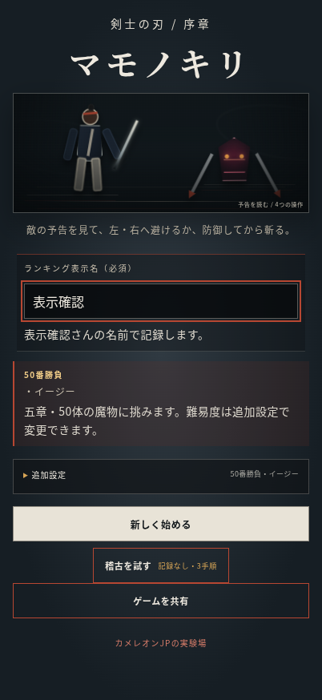
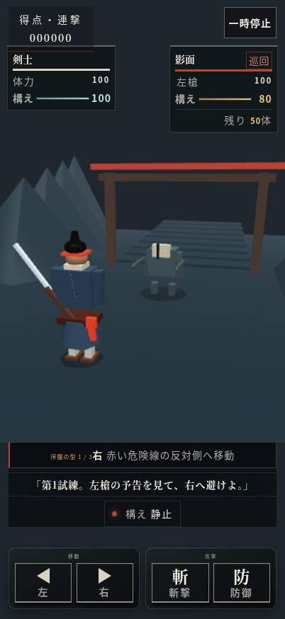
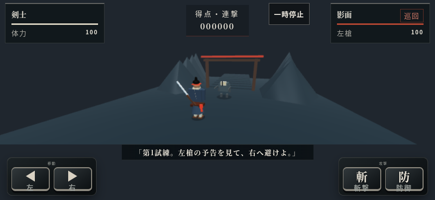
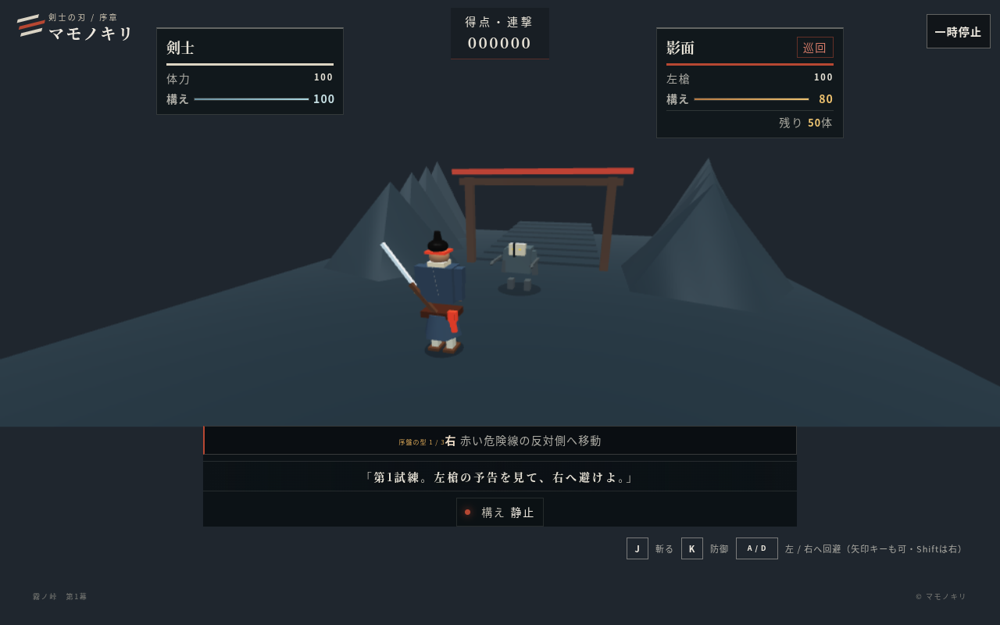

# マモノキリ：名称・勝負設定・表示の変更

- カメラを `(3.2, 5.2, -9.8)` から `(2.4, 4.15, -7.0)` へ移動。注視点と戦闘座標は維持し、縦長画面の追加距離を24%から18%へ縮小。
- 半球光・輪郭光・背景を明るくし、霧密度を0.045から0.035へ調整。タイトルの背景と人物紹介も明るくした。
- 剣士の刀・袴・鉢巻・髷を残し、笠・杖・数珠と付随する動作を除去。
- タイトル、ブラウザタブ、共有文、HUDを「マモノキリ」「剣士」へ変更。
- 正式勝負は開始・再挑戦・稽古からの移行とも50番勝負へ固定。旧10番・25番の保存データを正式勝負として再開できないようにした。旧内部キーは記録互換のため維持。
- 難易度の表示はイージー・ノーマル・ハード。内部キーと難易度係数は維持。
- 安全稽古は既存の3手順・非記録の補助導線を維持。

## 検証

- `vitest run`: 18ファイル、179テスト成功。
- `tsc --noEmit`: 成功。
- `vite build --base=/mamonokiri/`: 成功（既存の大きなチャンクの警告あり）。
- `scripts/verify-visual-quality.mjs`: 132件、ページエラー0件。タッチ操作、タイトル、敵17種、章背景、武器接続などを確認。
- Chromium / SwiftShaderで402×874、874×402、1280×800を確認。実機Safariの確認は未実施。

