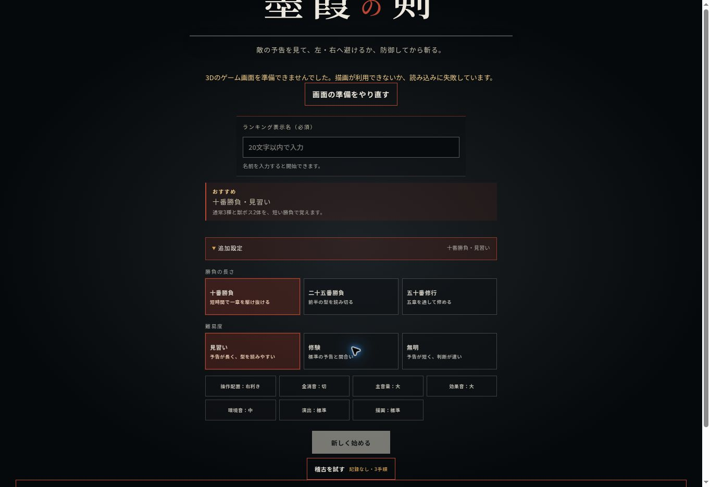

# 墨霞の剣：視覚・動作・操作・UI/UX 品質監査

初回監査：2026-10-01／ハーネス照合・改訂：2026-10-02／対象：mamonokiri／基準：main 14f17c89da689aa71e54813ee49c362347b691a2

**ハーネス2.6.0と照合し、88件の課題を15の共通実装契約・30の受入検査へ結び付けた。優先するのは、戦闘床と足・危険表示の高さ、槍の接続、反撃の命中時刻、左右の操作、タイトルと文字の読みやすさである。** その後に人物の動作、17種の敵、5章の景観、演出と全画面の使いやすさを磨く。

この資料は実装前の課題一覧である。各項目は「現状」「課題」「改善案」「完了条件」と根拠を持つ。個別の見た目の改善案や新しい操作案を、既に確定した仕様とは扱わない。今回の変更は資料と再現記録で、ゲーム本体のコードは変更していない。

## 1. 確認範囲と判定の読み方

- 基準mainの実装・仕様・テスト・公開タイトルを初回監査で確認。2026-10-02の照合時点でもmainが同じcommitであることを確認した。実行済み結果は初回監査の記録で、今回の改訂後にゲームが改善した結果ではない。
- Babylon.jsのNullEngineで実際のシーンを生成し、床・足・危険帯の境界、槍の位置、キーボード、反撃時のHPと姿勢を再現した。画像の見た目を描画した検証ではない。
- 公開サイトの確認ブラウザはWebGL非対応だったため、3D戦闘は描画できなかった。タイトルのエラー状態の画像とDOMは確認できた。通常起動時に同じ崩れが出るとは断定しない。
- iPhone実機の3D映像、親指の操作感、熱、長時間FPSは未確認。該当箇所は「要実機確認」として残した。

| 確認区分   | 件数 | 意味                                                                                     |
| ---------- | ---: | ---------------------------------------------------------------------------------------- |
| 実装確認   |   45 | コードや実行した数値で現状を確認。見た目への影響は推定を含み、完成判定は実描画でも行う。 |
| 要実機確認 |    9 | 問題の有無や程度を実機で確認してから調整する。                                           |
| 改善提案   |   32 | 現状を踏まえた美術・UXの設計案。評価して採用を決める。                                   |
| 画像確認   |    2 | 今回のブラウザ・状態で画像とDOMを確認。端末や正常起動へ一般化しない。                    |

| 優先度 | 件数 | 判断基準                                                       |
| ------ | ---: | -------------------------------------------------------------- |
| P0     |    8 | 先に直す。必要情報や操作、動作と命中の成立を損なう。           |
| P1     |   70 | 主要な品質改善。人物・敵の可読性と画面の使いやすさに直接効く。 |
| P2     |   10 | 基礎が整ってから磨く。細部・二次動作・検証効率を高める。       |

## 2. 最優先の8項目

| ID          | 確認したこと                                       | 最初の改善                                   |
| ----------- | -------------------------------------------------- | -------------------------------------------- |
| [H04](#h04) | 床が石段なのに人物・表示はほぼ一定の高さ。         | 平坦な戦闘床と共通の床高さを定義。           |
| [B04](#b04) | 草履上端約0.073 ＜ 床上端約0.260。                 | 人物ルートと足の接地を床へ合わせる。         |
| [G01](#g01) | 危険線上端約0.053 ＜ 床上端約0.500。               | 危険帯を床の上へ配置。                       |
| [G02](#g02) | 伸長時の槍軸前端と穂先中心に約1.491の差。          | 穂先位置を軸の端から算出。                   |
| [C01](#c01) | 反撃90msで命中開始、動作は約106msまで抜き姿勢。    | 有効時間と振り動作を同じ時刻へ合わせる。     |
| [I01](#i01) | Shiftは右回避のみ。A・左矢印は未対応。             | 左右回避のキーボード入力と説明を実装。       |
| [J01](#j01) | WebGLエラー状態で人物枠が縮小し、設定展開で約2px。 | 人物枠の最小高さを守り、縦スクロールを整理。 |
| [L01](#l01) | 7～10px級のHUD文字、一部34～40pxの設定操作。       | 情報を絞り、文字と操作領域を拡大。           |

H04はB04・G01の共通原因への対応である。別々の数値だけを直すと、床やレーンが変わった時に再発するため、同じ床高さを参照する設計を先に行う。

## 3. 分野別の件数

| 分野                       | ID       | 件数 |
| -------------------------- | -------- | ---: |
| 画面構成・描画             | A01～A08 |    8 |
| プレイヤーの造形           | B01～B06 |    6 |
| プレイヤーの動作・攻撃     | C01～C10 |   10 |
| 敵全体の造形・動作         | D01～D04 |    4 |
| 通常敵7種の個別改善        | E01～E07 |    7 |
| ボス10種の個別改善         | F01～F10 |   10 |
| 敵の攻撃・予兆・判定表示   | G01～G06 |    6 |
| ステージ・世界観           | H01～H07 |    7 |
| 操作・入力フィードバック   | I01～I07 |    7 |
| ゲーム全体のUI・UX         | J01～J11 |   11 |
| 効果・演出                 | K01～K06 |    6 |
| 読みやすさ・端末品質・検証 | L01～L06 |    6 |

## 4. 目指す品質と実装の順序

美術の方向候補は、現在の山伏・霧・剣戟を保ち、墨色・朱・生成り、明快な輪郭、既存予告時間内で読める予兆、重心が伝わる動作へ揃える。配色や新造形は採用済み仕様ではなく、代表場面で比較する提案である。現在の「外部画像・テクスチャ・モデルを使わずコードで生成する」方針を前提とする。細部の量より、iPhoneの実サイズで形と行動を理解できることを優先する。

| 段階                  | まとめて扱う改善                                                                                    | 完了判断                                                                                   |
| --------------------- | --------------------------------------------------------------------------------------------------- | ------------------------------------------------------------------------------------------ |
| 1：成立と読みやすさ   | 共通床、足、危険帯、槍、反撃時刻、左右操作、タイトル、HUD、文字。カメラと画面領域を本編で比較する。 | 見える範囲と判定が一致し、必須操作と予兆を読める。                                         |
| 2：人物と戦闘動作     | 人物の向き・握り・関節・姿勢遷移、敵の共通関節と材質、予兆、接触効果、停止時計。                    | エフェクトを抑えても準備・有効・戻り・命中を読める。                                       |
| 3：17種と5章の個性    | 通常敵7種・ボス10種を個別造形、固有攻撃、景観、登場と撃破。                                         | 代表場面の品質を保ち、色や名前を隠しても敵と章を区別できる。既存の攻撃列と判定を維持する。 |
| 4：全画面と実機仕上げ | 初回案内、停止、報酬、結果、共有、ランキング、フォーカス、長時間端末検証。                          | 最初の起動から再挑戦まで迷わず進み、長時間でも読めて操作できる。                           |

各段階をまとまったPRへ分ける案であり、88件を88本のPRにする必要はない。資料内の段階番号は作業の目安で、依存するP0が先になる。I03の先行入力は比較・採否を決める別案である。本計画の見た目の改善を理由に、入力補助・時間停止・振動・新しい攻撃判定を無断導入しない。

既にある画質・演出設定、タッチの二重入力対策、700msの再開保護、安定した保存境界、モード別ランキング、読込失敗時の案内は改善の土台として残す。これらを未実装の機能として数えていない。

### 4.1 ハーネスの参照版と今回の選択

参照：[chameleonjp-browser-game-harness](https://github.com/chameleonjp-lab/chameleonjp-browser-game-harness/tree/c60683b504b68262dae8b4fc723b416077def8b5)、hub_version **2.6.0**、commit c60683b504b68262dae8b4fc723b416077def8b5。registryのplan／work／engine:otherと今回の作業領域から関連24モジュールを選択し、依存先も読んだ。実エンジンはBabylon.js 9.20.1であり、Three.js専用設定を移植しない。

これはゲームへハーネスを全面採用する変更ではなく、改善計画の照合記録である。選択モジュールのfield_evidenceはすべて空で、ハーネスの検査例をこのゲームで実行済みの証拠に数えない。音・バックエンド・新物理・経路探索・Worker・外部素材は今回の視覚改善へ一律追加しない。

| 多角的な観点                   | 照合で具体化したこと                                                                        | 対応          |
| ------------------------------ | ------------------------------------------------------------------------------------------- | ------------- |
| 構図・造形                     | 通常カメラで表示サイズと輪郭を決め、床・握り・前方軸・攻撃部の接続を先に成立させる。        | Q01〜Q03      |
| 動作・遊びの理解               | 4技の予約時刻を維持して姿勢を合わせる。飛刃・追撃・追尾・フェイントを現行行動から表示する。 | Q04・Q06・Q07 |
| 材質・景観                     | 部位の素材差、支持影、霧と背景の明度を本編で確認。装飾乱数は戦闘から分離する。              | Q05・Q08      |
| 操作・日本語・アクセシビリティ | 開始指・取消し・IME・実受付・200%文字・フォーカス・VoiceOver・動作抑制を分けて検査する。    | Q09〜Q11      |
| 失敗・復帰・共有               | 既存の安全保存・再試行世代・700ms・共有取消しを保持。描画喪失と遅い共有完了の境界を補う。   | Q12・Q14      |
| 演出・性能・検証               | 装飾は確定イベントへ従い、判定や採点へ戻さない。既存実機目標と整合性／体験の別検査を使う。  | Q13・Q15      |

### 4.2 前版から修正した解釈

| 項目                    | 修正後の扱い                                                                                                                 |
| ----------------------- | ---------------------------------------------------------------------------------------------------------------------------- |
| C01・C03〜C05           | 通常は飛刃を放つ。敵へ近接する踏み込み案へ置換せず、通常の60ms到着と反撃90ms等の予約時刻を維持する。動作側を時刻へ合わせる。 |
| E04・F02・F07・F08      | 三手の攻撃順と即時の三連撃を混同しない。鎧熊の追撃、鳥の急降下・着地後追撃を動作にも残す。                                   |
| F03・F04・F09・F10・G06 | 膨張・全域の見た目だけから安全範囲を推定しない。既存判定を中央・左右端・回避途中・防御で照合して表示へ写す。                 |
| J09                     | 共有取消しでコピーしない処理、ランキングの旧要求防止はすでにある。不足は結果導線・意味の明確化・共有完了の画面世代境界。     |
| J11                     | 安全稽古3体、失敗回復、固定の序盤順はすでにある。新しい必須導入を作る提案から、現行案内を読みやすくする提案へ改訂。          |
| L01                     | 44pxはハーネス方針、48pxは目安。WCAG最小条件と混同せず、透明な大領域ではなく実受付先を確認する。                             |
| L04                     | 前版の30fps最低案を撤回。既存品質計画のiPhone 17 Pro・30分・60fps・CPU処理p95 20ms以下を維持し、計測条件と未測定を明記。     |
| L06                     | 比較画面は必要時の補助。実際の本編経路を使い、展示専用の別実装や全基盤整備をP0修正の前提にしない。                           |

### 4.3 共通原因をまとめて直す実装契約

Qは課題を増やす番号ではなく、88件をまとめて実装するための責務である。各Qに数値・状態・実入力を確かめる整合性検査（-I）と、本編を見て操作する体験検査（-E）を用意する。両者を平均して完成にしない。改修後の30検査は計画であり、すべて未実行である。

<a id="q01"></a>

#### Q01 カメラと実際に見える戦闘領域

対象：A01・A02・A03・A08・G06・H07／依存：着手可能。実装中から確認する。

**実装の責務：** arena.tsとGameCanvasの責務を使い、CSS矩形・描画バッファ・DPR・安全領域を分ける。HUDと操作を除いた領域に全身・最大ボス・危険帯を投影し、基準カメラへ一時補正を加える。

**Q01-I 整合性：** 全3レーン、最大ボス、画面回転・短い高さ・0寸法復帰で必要頂点の投影と入力変換を検査。戦闘座標と判定を不変にする。

**Q01-E 体験：** 本編カメラで縦横の連続戦闘を見る。刀・全身・危険側が読め、左右の操作を画面の方向へ対応づけられる。

<a id="q02"></a>

#### Q02 共通床・接地・危険帯

対象：A04・B04・G01・H04・K01／依存：Q01

**実装の責務：** scene.tsの戦闘床を一つの基準へ統一し、人物足底・敵支持点・危険帯・接触影・着地効果が同じ高さを読む。石段は戦闘面と分ける。

**Q02-I 整合性：** 左・中央・右の足底と床面、危険帯の上下境界、各動作の支持点を実シーンで測る。許容誤差と表示用浮かせ量は設計値として明記する。

**Q02-E 体験：** 待機・回避・着地・重い攻撃を高／軽量で見る。足が沈まず、浮遊と接地を区別でき、影で床との距離が分かる。

**初回監査の不成立：** 草履上端0.073＜床0.260、危険線上端0.053＜床0.500を観測。接地の受入条件を満たさない。 根拠：S19。改修後の成功記録ではない。

<a id="q03"></a>

#### Q03 向き・接続点・変換

対象：B01・B02・B03・B06・G02・D01／依存：Q02

**実装の責務：** proceduralCharacterの前方軸・足元原点・手の握り点・刀の親ノード・関節を定める。槍は基点から軸端と穂先後端を求める。表示子ノードの変形を判定ルートへ混ぜない。

**Q03-I 整合性：** 全4技の代表時刻と左右レーンで手／柄・軸／穂先接続、前方内積、親子変換を検査。誤った接続配置が検査で落ちることも確かめる。

**Q03-E 体験：** 本編の実サイズと正面・側面の診断で握り・面の向き・袖と刀の貫通を見る。拡大展示だけで完成にしない。

**初回監査の不成立：** 最大伸長で槍軸端と穂先中心に約1.491の差があり、穂先が軸の途中へ入る。 根拠：S19。改修後の成功記録ではない。

<a id="q04"></a>

#### Q04 攻撃時刻と姿勢の単一基準

対象：B05・C01・C02・C03・C04・C05・C06・C07・C08・C09・C10／依存：Q03

**実装の責務：** rules.tsの技時刻とscene.tsの確定状態をproceduralCharacterへ渡す。基本姿勢→遷移補間→二次動作→一時反応の順を決め、ゲーム時刻と表示時刻を分ける。通常の飛刃60msと他技の命中を維持する。

**Q04-I 整合性：** 同じ種・意味上の入力・RunClockで全技、full/minimal、停止／再開を比較し、HP・構え・得点・位置・乱数・時刻が一致する。反撃90ms前後の姿勢を検査する。

**Q04-E 体験：** エフェクトを抑えた連続動作で準備・放出／有効・戻り・受け・被弾を読める。映像保存の有無でなく、実際の動作を見て評価する。

**初回監査の不成立：** 反撃100msでHPが減る一方、全体0.24までの抜き姿勢が残る。 根拠：S19。改修後の成功記録ではない。

<a id="q05"></a>

#### Q05 部位の材質と本編照明

対象：A05・A06・A07・D02・H03・H05／依存：Q01

**実装の責務：** 体・布・金属・骨・石・眼の材質責務を定め、予告発光で全身を上書きしない。照明、霧、色出力、明るさ変換の担当を整理し、現行コード生成・Babylon.jsを土台にする。

**Q05-I 整合性：** 予告開始／終了、敵切替、再挑戦で材質の初期化と共有範囲を照合。装飾乱数でゲームRNGを進めず、画質差で判定を変えない。

**Q05-E 体験：** にじみ等を外した診断と本編照明を比較し、布・刀・牙・石と背景を区別する。白飛び・黒潰れ・点滅を実画像で見る。

<a id="q06"></a>

#### Q06 通常7種の役割を造形と動作へ写す

対象：D03・D04・E01・E02・E03・E04・E05・E06・E07／依存：Q03・Q04・Q05

**実装の責務：** 影面=左、角岩=右、鳴壺=交互、逆鉾=三手、霧猿=追尾、鉄輪=二撃、骨灯=重量を現行定義へ対応。AttackPlan・予告時刻・支持構造から姿勢を作り、形だけの色違いを脱する。

**Q06-I 整合性：** 既存の敵ID・順序・攻撃列・対象レーン・周期を照合。追尾55%の固定、二撃後の待機、被弾・撃破による取消しを検査し、新AIを足さない。

**Q06-E 体験：** 色と名前を隠した輪郭、通常カメラの予告・攻撃・戻りを比較する。役割差が姿勢で分かり、初撃後と攻撃終了を誤認しない。

<a id="q07"></a>

#### Q07 ボス10種の系統と前後半

対象：F01・F02・F03・F04・F05・F06・F07・F08・F09・F10・G05／依存：Q06

**実装の責務：** 獣は牙／肩と追撃、怪物は膨張と眼、人型は一度のフェイント、鳥は急降下と着地後追撃、石造は支持部と全域を使う。既存前後半を表示へ写し、専用造形と攻撃部を作る。

**Q07-I 整合性：** 全10種の前後半、各攻撃の中央・端・回避途中・防御でAttackPlanと判定を照合。人型55%反転、追撃列、石造全域の実安全条件を残す。

**Q07-E 体験：** 本編で系統と個体を輪郭・重心・予告から区別する。後半変化を粒子に埋めず、最大サイズでも攻撃部と危険帯が読める。

<a id="q08"></a>

#### Q08 5章の景観・到達と進行

対象：H01・H02・H06／依存：Q02・Q05

**実装の責務：** 既存章名・出現順・報酬境界から背景と場所表示を生成する。戦闘面は共通にし、章は大きな地形・柱・空・明暗で区別する。装飾生成は別の種と再利用する静的結果を使う。

**Q08-I 整合性：** 10／25／50体、章報酬前後、安全保存からの再開、最終50体目の結果で章・景観・表示を照合。背景種変更で敵順／戦闘RNGが変わらない。

**Q08-E 体験：** 各章を通常カメラで見て形と奥行きの違いを読める。手前装飾が人物・予告・着地を遮らず、低画質でも章の手掛かりが残る。

<a id="q09"></a>

#### Q09 実入力と受付・取消し

対象：I01・I02・I03・I04・I05・I06／依存：着手可能。実装中から確認する。

**実装の責務：** Appのpointer受付とsceneの技受付を一つの意味上の操作へ結ぶ。開始指・取消し・二重入力を維持し、IMEと入力欄からキーを除外する。接触・受理・確定命中を分ける。先行入力I03は採否を決める別案。

**Q09-I 整合性：** 左右PCキー、二本指、領域外終了、lostpointercapture、blur、repeat、変換Enter、支援技術clickを操作する。タッチとPCで同じ意味の入力結果を照合。

**Q09-E 体験：** 片手／両手で届き方、押し間違い、反撃合図、拒否理由を確認。DOM寸法だけでタップ成功や即応性を合格にしない。

**初回監査の不成立：** A／左矢印で左回避せず、Shiftが右へ固定。タッチの操作感は未確認。 根拠：S19。改修後の成功記録ではない。

<a id="q10"></a>

#### Q10 画面階層・日本語・文字と操作領域

対象：J01・J02・J03・J04・J05・J07・J11・L01・L02／依存：着手可能。実装中から確認する。

**実装の責務：** タイトル→名前→開始→戦闘→停止→報酬→結果を既存導線で整える。主要操作と必須情報を先にし、44px以上の標準領域と実受付を照合。長い名前・説明・代替フォント・200%文字を扱う。

**Q10-I 整合性：** 読込／正常／失敗・設定開閉、長い日本語、IME、フォント準備／失敗、文字200%、短い高さで欠損と隣接受付を確認。名前の20文字処理を無断で別規則へ変えない。

**Q10-E 体験：** 一行動に一つの案内を対応させ、危険側・反撃・開始／再挑戦が一目で分かるか実操作する。既存稽古を改善し、必須の新モードへ置き換えない。

**初回監査の不成立：** WebGL非対応の設定展開時に人物枠が約2pxへ縮む。正常起動の3D表示へは一般化しない。 根拠：S20・S25。改修後の成功記録ではない。

<a id="q11"></a>

#### Q11 停止・モーダルとアクセシビリティ

対象：J06・L03／依存：Q09・Q10

**実装の責務：** 停止／報酬／結果の背後で戦闘操作を止め、フォーカス移動・閉じた後の復帰を揃える。色と形、OSとゲームの動作抑制、必要な説明スクロールを両立する。

**Q11-I 整合性：** 複数停止理由、ダイアログ内外、背景キー、変換、200%文字、OS動作抑制を検査。演出量で判定・時間・得点を変えない。

**Q11-E 体験：** キーボードとVoiceOverで主要操作の意味と焦点を実確認する。ラベルだけで読み上げ合格とせず、抑制設定でも必要情報を読める。

<a id="q12"></a>

#### Q12 準備・失敗・中断からの復帰

対象：I07・J10／依存：Q09・Q10

**実装の責務：** 既存の初回描画成功待ち・試行世代・安全保存・700ms再開保護を使う。非対応／一時失敗／描画中喪失を分け、Babylon.jsの復旧とアプリ側の停止・案内の責務を確認する。

**Q12-I 整合性：** 準備中開始、連続再試行と遅い旧完了、描画喪失、bfcache、通知、停止理由重複、安全保存再読込を検査。復帰で新勝負や結果再送をしない。

**Q12-E 体験：** 名前や選択を失わず、状態と次の行動を日本語で読める。700msの終わりと入力再開が一致し、非対応時に無意味な再試行を誘わない。

<a id="q13"></a>

#### Q13 確定イベントと演出の寿命

対象：G03・G04・K02・K03・K04・K05・K06／依存：Q04・Q05

**実装の責務：** 本体の確定イベントに反応する表示経路へ揃える。勝負・対象・イベント・世代を照合し、画面占有・寿命・同時数を制限する。カメラ揺れは基準へ収束させ、装飾終了から採点しない。

**Q13-I 整合性：** 同じイベントの再配送と別の正当イベント、低頻度描画、停止・撃破・次敵・再挑戦を照合。full/minimalで判定・得点・ゲームRNGを同じに保ち、残存数を測る。

**Q13-E 体験：** 密集戦闘の連続出力を見て、危険・選択・被弾・反撃が残ることを確認。点滅は効果単体の頻度でなく合成面積と明るさも見る。

<a id="q14"></a>

#### Q14 結果・共有・記録の意味

対象：J08・J09／依存：Q10・Q11

**実装の責務：** 現行結果と共有文・公開URLを一つの結果から作る。AbortErrorでコピーしない既存経路、ランキング重複と旧要求防止を保持する。共有Promise成功を外部投稿確認へ言い換えない。

**Q14-I 整合性：** 勝利／敗北／リタイア／稽古、共有成功／取消し／非対応／コピー失敗、遅い完了後の画面切替を検査。検査は外部投稿や本番ランキング書込をしない。

**Q14-E 体験：** 結果から再挑戦と共有へ迷わず到達できる。成功／取消し／失敗の文言、スクロール、共有文の長さをiPhoneで確認し、開発者IDを見せない。

<a id="q15"></a>

#### Q15 性能・比較条件と完成判断

対象：L04・L05・L06／依存：着手可能。実装中から確認する。

**実装の責務：** 既存起動／検査を使い、必要箇所だけ実行検査を補う。コード・依存・場面・種・入力・時刻・カメラ・画質・CSS／描画寸法・ブラウザ・フォント準備を固定する。本編と別の展示物を正本にしない。

**Q15-I 整合性：** 初回／通常／最大負荷／再挑戦／30分を分け、60fpsとCPU処理p95≤20msの既存目標を個別に測る。p50/p95/p99、標本数、資源残存、取得できないGPU値を区別する。

**Q15-E 体験：** 通常の連続プレイで描写・読み合い・入力反応・熱の悪化を確認する。画像比較は差分検出として使い、美しさや本人承認の自動採点にしない。

### 4.4 量産前に仕上げる代表場面と4つの実装単位

代表場面は、主人公、通常敵「影面」、獣ボス「牙嶺」、第1章「霧ノ峠」。実際の本編生成・光・材質・動作・カメラで、待機、通常飛刃、反撃、防御、左右回避、敵予告、二撃目、被弾、撃破を仕上げる。まず高／軽量と縦／横で確認し、その規則を残りの敵・章へ広げる。PCの拡大展示だけで合格しない。

| 実装単位              | まとめる範囲・先行条件                                                                                              | 次へ進む条件                                                                                               |
| --------------------- | ------------------------------------------------------------------------------------------------------------------- | ---------------------------------------------------------------------------------------------------------- |
| 1：成立と画面         | P0、共通床、足、危険帯、握り／槍、反撃時刻、画角、PC左右、タイトル、必須HUD。材質と性能はこの段階から測る。         | 接続・時刻・方向の数値検査が成立し、本編で全身と予告が読める。見えない原因を粒子追加で隠さない。           |
| 2：代表場面           | 単位1を土台に、主人公の全技、影面・牙嶺、霧ノ峠を本編品質へ仕上げる。Q03〜Q07・Q13の共通規則をここで作る。          | 最小演出でも技・危険側・追撃を読める。連続動作、支持点、素材差、低画質を確認してから量産する。             |
| 3：17種と5章          | 単位2で確認した形・材質・時刻の規則を、残り6通常敵・9ボス・4章へ展開。既存内容ID・出現順・各攻撃を維持する。        | 全種の前後半・境界と章到達が一致。色や名前だけに頼らず個体を識別でき、最大ボスでも必要情報を失わない。     |
| 4：全導線と実機仕上げ | 停止・報酬・結果・共有・稽古・フォーカス・文字拡大・復帰を通して仕上げる。単位1からの性能計測を30分条件まで広げる。 | 初回から再挑戦まで実操作できる。iPhoneの既存性能目標と継続品質を記録。阻害／未実行の検査は完成へ数えない。 |

これは88本のPRへ分割する案ではない。共通原因を含むまとまった変更として提出する。文字・入力・性能の確認を最後まで先送りせず、代表場面で悪化が出たら、その原因の契約へ戻って直す。造形量・ポリゴン数・項目数・動画本数の増加そのものを品質得点にしない。

### 4.5 実装前に固定する比較条件

記録する条件は、対象commit／lockfile、場面と敵ID・前後半、勝負種と意味上の入力列、ゲーム時刻、カメラ、画質と演出設定、CSS可視寸法と描画バッファ、端末／OS／ブラウザ、フォント準備、継続時間。入力受信→受付→表示要求→実表示は観測できた地点を区別する。CPU処理時間・フレーム間隔・GPU時間を同じ数値として扱わない。

初回監査画像、改善候補、本人が採用した美術基準は別物として扱う。見た目の判断が未確定でも、床・接続・予約時刻・実受付の修正と確認は進められる。実機がない時は、その制約を残して計画と実行可能な検査を完成させる。

## 5. 個別課題と改善案

### A. 画面構成・描画

<a id="a01"></a>

#### A01 戦闘に必要な画面領域を先に確保する

実装契約：[Q01](#q01)／整合性：Q01-I／体験：Q01-E

優先度：**P1**／確認区分：実装確認／実装段階：1

| 項目     | 内容                                                                                                                      |
| -------- | ------------------------------------------------------------------------------------------------------------------------- |
| 現状     | カメラは縦画面で距離を補正するが、上下のHUDを除いた戦闘用の表示領域は定義していない。                                     |
| 課題     | 端末比率やHUD量によって、刀・敵の予兆・足元が狭い領域に集中する可能性がある。                                             |
| 改善案   | 安全領域、上部HUD、下部操作を除いた矩形に、プレイヤー・敵・攻撃範囲を収める。カメラの距離と注視点を同じ矩形から算出する。 |
| 完了条件 | 小型iPhoneから大画面まで、全攻撃の予兆とプレイヤー全身が読める。ダメージ表示も主動作を隠さない。                          |

根拠：[S13：カメラ・レーン](https://github.com/chameleonjp-lab/mamonokiri/blob/14f17c89da689aa71e54813ee49c362347b691a2/client/src/game/arena.ts#L1-L66)、[S09：画面・ダイアログ・操作UI](https://github.com/chameleonjp-lab/mamonokiri/blob/14f17c89da689aa71e54813ee49c362347b691a2/client/src/App.tsx#L621-L1622)

<a id="a02"></a>

#### A02 人物と敵の見える大きさを端末ごとに決める

実装契約：[Q01](#q01)／整合性：Q01-I／体験：Q01-E

優先度：**P1**／確認区分：要実機確認／実装段階：1

| 項目     | 内容                                                                                         |
| -------- | -------------------------------------------------------------------------------------------- |
| 現状     | 縦画面の距離補正はある。実機のスクリーンショットから人物の高さ・刀の太さを測った記録はない。 |
| 課題     | キャラクターを作り込んでも、小さすぎる表示では顔・構え・攻撃の違いが届かない。               |
| 改善案   | 各画面で人物のピクセル高と刀・目の最小太さを測り、通常戦と大型ボス戦のカメラを調整する。     |
| 完了条件 | 腕の構え、刀の向き、敵の攻撃開始が画面拡大なしで区別できる。調整前後の実機画像を残す。       |

根拠：[S13：カメラ・レーン](https://github.com/chameleonjp-lab/mamonokiri/blob/14f17c89da689aa71e54813ee49c362347b691a2/client/src/game/arena.ts#L1-L66)、[S04：人物の生成部品](https://github.com/chameleonjp-lab/mamonokiri/blob/14f17c89da689aa71e54813ee49c362347b691a2/client/src/game/proceduralCharacter.ts#L158-L744)

<a id="a03"></a>

#### A03 画面の左右と回避方向を一致させる

実装契約：[Q01](#q01)／整合性：Q01-I／体験：Q01-E

優先度：**P1**／確認区分：要実機確認／実装段階：1

| 項目     | 内容                                                                                                                                                         |
| -------- | ------------------------------------------------------------------------------------------------------------------------------------------------------------ |
| 現状     | カメラは斜め位置に固定され、回避はワールド座標のX方向に移動する。                                                                                            |
| 課題     | 横スワイプの期待する方向と、画面に見える移動量・危険側の表示が直感的に一致するか未確認。                                                                     |
| 改善案   | 左右レーンを画面へ投影して順序・距離を測り、正面寄りのカメラと注視点を比較する。左−0.9・中央0・右0.9の戦闘座標と入力の意味を維持し、画角で分かりやすくする。 |
| 完了条件 | 左右攻撃、左右ボタン、スワイプ、PCキーの意味と画面上の方向が一致する。縦横切替でも到達レーン・危険判定・得点が同じ。体感は実機で確認する。                   |

根拠：[S13：カメラ・レーン](https://github.com/chameleonjp-lab/mamonokiri/blob/14f17c89da689aa71e54813ee49c362347b691a2/client/src/game/arena.ts#L1-L66)、[S08：操作・キーボード](https://github.com/chameleonjp-lab/mamonokiri/blob/14f17c89da689aa71e54813ee49c362347b691a2/client/src/game/scene.ts#L2810-L2935)、[S26：現行仕様：飛刃・稽古・固定レーン・時計・復帰](https://github.com/chameleonjp-lab/mamonokiri/blob/14f17c89da689aa71e54813ee49c362347b691a2/docs/CURRENT_SPEC.md)

<a id="a04"></a>

#### A04 足元と敵に接地感をつける

実装契約：[Q02](#q02)／整合性：Q02-I／体験：Q02-E

優先度：**P1**／確認区分：実装確認／実装段階：1

| 項目     | 内容                                                                                                                                                                           |
| -------- | ------------------------------------------------------------------------------------------------------------------------------------------------------------------------------ |
| 現状     | 照明はHemisphericLight中心で、ShadowGeneratorや足元の接触影を生成していない。                                                                                                  |
| 課題     | 人物・敵が床から浮いて見える要因になり、跳躍・着地・体重移動も弱くなる。                                                                                                       |
| 改善案   | 共通床面を直してから、草履の支持点と敵の支持部へ軽量な接触影を置く。浮遊中は床との距離に応じて影を薄く広げる。動的影は高画質の費用対効果を測って選び、軽量でも接地情報を残す。 |
| 完了条件 | 静止・回避・着地で床との距離が分かる。低画質のiPhoneでも影が消えて姿勢判断を妨げない。                                                                                         |

根拠：[S02：照明・床・石段・鳥居](https://github.com/chameleonjp-lab/mamonokiri/blob/14f17c89da689aa71e54813ee49c362347b691a2/client/src/game/scene.ts#L650-L762)、[S15：画質・設定](https://github.com/chameleonjp-lab/mamonokiri/blob/14f17c89da689aa71e54813ee49c362347b691a2/client/src/game/config.ts#L1-L133)

<a id="a05"></a>

#### A05 石・布・金属・骨の材質を分ける

実装契約：[Q05](#q05)／整合性：Q05-I／体験：Q05-E

優先度：**P1**／確認区分：実装確認／実装段階：1

| 項目     | 内容                                                                                                                                                                                                    |
| -------- | ------------------------------------------------------------------------------------------------------------------------------------------------------------------------------------------------------- |
| 現状     | StandardMaterialの色と発光を主に使い、共通の弱い反射値を設定している。                                                                                                                                  |
| 課題     | 刀、衣服、岩、骨が同じ表面に近づき、形の情報だけでは質感が伝わりにくい。                                                                                                                                |
| 改善案   | 刀の狭い反射、布の広い陰影、石の鈍い面、骨の暖色の低反射を本編照明で調整する。コード生成と現行材質を土台に面取り・部位別材質を使う。色・明るさ変換の担当を一本化し、PBRや外部モデル導入を必須にしない。 |
| 完了条件 | 同じ照明下の比較画面で、色を弱めても刀・布・石の区別がつく。発光が表面の形を消さない。                                                                                                                  |

根拠：[S02：照明・床・石段・鳥居](https://github.com/chameleonjp-lab/mamonokiri/blob/14f17c89da689aa71e54813ee49c362347b691a2/client/src/game/scene.ts#L650-L762)、[S04：人物の生成部品](https://github.com/chameleonjp-lab/mamonokiri/blob/14f17c89da689aa71e54813ee49c362347b691a2/client/src/game/proceduralCharacter.ts#L158-L744)、[S01：敵定義・生成部品](https://github.com/chameleonjp-lab/mamonokiri/blob/14f17c89da689aa71e54813ee49c362347b691a2/client/src/game/scene.ts#L134-L633)

<a id="a06"></a>

#### A06 背景から人物と予兆を分離する

実装契約：[Q05](#q05)／整合性：Q05-I／体験：Q05-E

優先度：**P1**／確認区分：改善提案／実装段階：1

| 項目     | 内容                                                                                                               |
| -------- | ------------------------------------------------------------------------------------------------------------------ |
| 現状     | 霧・暗い背景・発光色が全体の基調。敵と背景の明度差について実機の測定はない。                                       |
| 課題     | 世界観を暗くするほど、輪郭と攻撃の予兆が背景へ埋もれるおそれがある。                                               |
| 改善案   | 背景の明度・細部を抑え、人物に細い縁光を入れる。白い霧の奥と戦闘手前で密度を分け、危険表示の周辺に余白を確保する。 |
| 完了条件 | 通常／低画質、屋内程度の明るさと屋外で、人物の手足と危険表示を追える。グレースケールでも主役が分かる。             |

根拠：[S02：照明・床・石段・鳥居](https://github.com/chameleonjp-lab/mamonokiri/blob/14f17c89da689aa71e54813ee49c362347b691a2/client/src/game/scene.ts#L650-L762)、[S15：画質・設定](https://github.com/chameleonjp-lab/mamonokiri/blob/14f17c89da689aa71e54813ee49c362347b691a2/client/src/game/config.ts#L1-L133)

<a id="a07"></a>

#### A07 形状の簡略化を意図した美術へ揃える

実装契約：[Q05](#q05)／整合性：Q05-I／体験：Q05-E

優先度：**P2**／確認区分：改善提案／実装段階：1

| 項目     | 内容                                                                                                                                                                                                 |
| -------- | ---------------------------------------------------------------------------------------------------------------------------------------------------------------------------------------------------- |
| 現状     | 人物・敵・舞台を主に箱、円柱、多面体で組み立てている。                                                                                                                                               |
| 課題     | パーツの継ぎ目と箱の角がそのまま出ると、作品の様式より仮組みの印象が強くなる。                                                                                                                       |
| 改善案   | 墨色・朱・生成りは方向性の候補として、主人公・影面・牙嶺・霧ノ峠の本編画面で比較する。輪郭、面の粗さ、接合を整え、顔・握り・武器へ造形を集中する。絵文字に頼らず、必要な記号は形と短い日本語で表す。 |
| 完了条件 | タイトル、人物、敵、ステージを並べても同じ作品に見える。継ぎ目が関節より目立たない。                                                                                                                 |

根拠：[S04：人物の生成部品](https://github.com/chameleonjp-lab/mamonokiri/blob/14f17c89da689aa71e54813ee49c362347b691a2/client/src/game/proceduralCharacter.ts#L158-L744)、[S01：敵定義・生成部品](https://github.com/chameleonjp-lab/mamonokiri/blob/14f17c89da689aa71e54813ee49c362347b691a2/client/src/game/scene.ts#L134-L633)、[S02：照明・床・石段・鳥居](https://github.com/chameleonjp-lab/mamonokiri/blob/14f17c89da689aa71e54813ee49c362347b691a2/client/src/game/scene.ts#L650-L762)

<a id="a08"></a>

#### A08 低解像度でも輪郭と刀を保つ

実装契約：[Q01](#q01)／整合性：Q01-I／体験：Q01-E

優先度：**P1**／確認区分：要実機確認／実装段階：1

| 項目     | 内容                                                                                                                   |
| -------- | ---------------------------------------------------------------------------------------------------------------------- |
| 現状     | 解像度倍率は高1.0、標準0.78、軽量0.58。DPRにも上限があり、細い輪郭の実機比較はない。                                   |
| 課題     | 軽量化で刀・目・危険線が消える、高画質で細い線がちらつく可能性がある。                                                 |
| 改善案   | 実サイズの画像で刀、目、輪郭、床線を比較し、形状の最低太さを決める。アンチエイリアスと解像度を負荷に合わせて調整する。 |
| 完了条件 | 全設定で武器と危険線が途切れず、動いても輪郭が強くちらつかない。iPhoneで比較画像を残す。                               |

根拠：[S15：画質・設定](https://github.com/chameleonjp-lab/mamonokiri/blob/14f17c89da689aa71e54813ee49c362347b691a2/client/src/game/config.ts#L1-L133)、[S16：描画起動・エラー](https://github.com/chameleonjp-lab/mamonokiri/blob/14f17c89da689aa71e54813ee49c362347b691a2/client/src/components/GameCanvas.tsx#L1-L161)、[S03：危険線・範囲表示](https://github.com/chameleonjp-lab/mamonokiri/blob/14f17c89da689aa71e54813ee49c362347b691a2/client/src/game/scene.ts#L763-L869)

### B. プレイヤーの造形

<a id="b01"></a>

#### B01 山伏剣士のシルエットを強くする

実装契約：[Q03](#q03)／整合性：Q03-I／体験：Q03-E

優先度：**P1**／確認区分：改善提案／実装段階：2

| 項目     | 内容                                                                                           |
| -------- | ---------------------------------------------------------------------------------------------- |
| 現状     | 笠、結袈裟、法衣、腰帯、脚絆などのコード生成パーツは存在する。                                 |
| 課題     | 小画面で重なる細部が多く、笠・肩・刀から主人公らしさを読む設計がまだ弱い。                     |
| 改善案   | 笠の幅、肩と袖、腰帯、裾の形を整理し、笠・結袈裟・刀の三要素が残るシルエットを作る。           |
| 完了条件 | 黒いシルエットだけでも主人公を識別でき、通常敵の輪郭と混同しない。縦画面の実サイズで確認する。 |

根拠：[S04：人物の生成部品](https://github.com/chameleonjp-lab/mamonokiri/blob/14f17c89da689aa71e54813ee49c362347b691a2/client/src/game/proceduralCharacter.ts#L158-L744)

<a id="b02"></a>

#### B02 手と刀の握りを成立させる

実装契約：[Q03](#q03)／整合性：Q03-I／体験：Q03-E

優先度：**P1**／確認区分：実装確認／実装段階：2

| 項目     | 内容                                                                                                                                               |
| -------- | -------------------------------------------------------------------------------------------------------------------------------------------------- |
| 現状     | 腕の関節と刀は別パーツとして生成されている。手指や握りの接触を検証する基準はない。                                                                 |
| 課題     | 振り動作で手と柄が離れる、両手の役割が曖昧になると攻撃の説得力が落ちる。                                                                           |
| 改善案   | 刀の柄に握り位置を設け、右手を主握り、左手を添え手として追従させる。手首から刀までの親子関係を見直す。                                             |
| 完了条件 | 通常・反撃・崩し・強撃の準備／有効／戻りを正面と側面で確認し、手と柄が接続する。本編の表示サイズでも握りが読め、刀の親子変換が二重に適用されない。 |

根拠：[S04：人物の生成部品](https://github.com/chameleonjp-lab/mamonokiri/blob/14f17c89da689aa71e54813ee49c362347b691a2/client/src/game/proceduralCharacter.ts#L158-L744)、[S05：人物の姿勢・動作](https://github.com/chameleonjp-lab/mamonokiri/blob/14f17c89da689aa71e54813ee49c362347b691a2/client/src/game/proceduralCharacter.ts#L745-L1056)

<a id="b03"></a>

#### B03 顔・胴体・刀の向きを敵へ揃える

実装契約：[Q03](#q03)／整合性：Q03-I／体験：Q03-E

優先度：**P1**／確認区分：実装確認／実装段階：2

| 項目     | 内容                                                                                                                   |
| -------- | ---------------------------------------------------------------------------------------------------------------------- |
| 現状     | 目の配置から読む人物の前方はローカル-Z。敵方向との内積は約-0.972だった。これは形状方向の検証で、実際の見え方は未確認。 |
| 課題     | 顔の向き、胴体の構え、攻撃先が逆向きに見える可能性がある。                                                             |
| 改善案   | 人物の前方軸を一つに定義し、顔・肩・足・刀とカメラ基準を揃える。敵を向いた構えを斜め画面でも見せる。                   |
| 完了条件 | 静止・防御・攻撃の画面で顔と刀が敵を向く。モデルの前方と敵方向の内積が正となり、実描画も確認する。                     |

根拠：[S04：人物の生成部品](https://github.com/chameleonjp-lab/mamonokiri/blob/14f17c89da689aa71e54813ee49c362347b691a2/client/src/game/proceduralCharacter.ts#L158-L744)、[S07：敵攻撃・更新・人物動作選択](https://github.com/chameleonjp-lab/mamonokiri/blob/14f17c89da689aa71e54813ee49c362347b691a2/client/src/game/scene.ts#L2950-L3720)、[S19：再現した形状・入力・命中の数値](audits/visual-quality-20261001/geometry-evidence.json)

<a id="b04"></a>

#### B04 草履と脚を床上に置く

実装契約：[Q02](#q02)／整合性：Q02-I／体験：Q02-E

優先度：**P0**／確認区分：実装確認／実装段階：1

| 項目     | 内容                                                                                                                     |
| -------- | ------------------------------------------------------------------------------------------------------------------------ |
| 現状     | 再現シーンで草履の上端は約0.073、同位置の石段上端は約0.260。草履全体が床面より下にある。                                 |
| 課題     | 脚の短さや浮遊・埋まりに見える原因になり、足を運ぶ動作が成立しない。                                                     |
| 改善案   | 戦闘位置の床高さを一元化し、人物のルートと足を合わせる。まず平坦な戦闘床を設け、その後必要に応じて足の接地補正を加える。 |
| 完了条件 | 全レーンで草履の底が床面に接し、待機・回避・攻撃で床を貫通しない。形状計算と画面の両方で確認する。                       |

根拠：[S02：照明・床・石段・鳥居](https://github.com/chameleonjp-lab/mamonokiri/blob/14f17c89da689aa71e54813ee49c362347b691a2/client/src/game/scene.ts#L650-L762)、[S04：人物の生成部品](https://github.com/chameleonjp-lab/mamonokiri/blob/14f17c89da689aa71e54813ee49c362347b691a2/client/src/game/proceduralCharacter.ts#L158-L744)、[S19：再現した形状・入力・命中の数値](audits/visual-quality-20261001/geometry-evidence.json)

<a id="b05"></a>

#### B05 布・髪・数珠の遅れを最終姿勢へ反映する

実装契約：[Q04](#q04)／整合性：Q04-I／体験：Q04-E

優先度：**P2**／確認区分：実装確認／実装段階：2

| 項目     | 内容                                                                                                     |
| -------- | -------------------------------------------------------------------------------------------------------- |
| 現状     | scene側で布や髪を動かした後に、updatePlayerMotionが姿勢をリセットして再適用する経路がある。              |
| 課題     | 追加した揺れが上書きされ、走りや斬撃に追従する細かな動きが届かない。                                     |
| 改善案   | 基本姿勢の計算後に二次動作を加える順序へ揃える。速度と加速度に応じた小さな遅れを布、髪、数珠へ分配する。 |
| 完了条件 | 回避停止と斬撃後に一度遅れて収束する。静止で震え続けず、低画質でも重要な裾の動きは残る。                 |

根拠：[S05：人物の姿勢・動作](https://github.com/chameleonjp-lab/mamonokiri/blob/14f17c89da689aa71e54813ee49c362347b691a2/client/src/game/proceduralCharacter.ts#L745-L1056)、[S07：敵攻撃・更新・人物動作選択](https://github.com/chameleonjp-lab/mamonokiri/blob/14f17c89da689aa71e54813ee49c362347b691a2/client/src/game/scene.ts#L2950-L3720)

<a id="b06"></a>

#### B06 衣服・腕・刀の貫通を動作ごとに直す

実装契約：[Q03](#q03)／整合性：Q03-I／体験：Q03-E

優先度：**P1**／確認区分：要実機確認／実装段階：2

| 項目     | 内容                                                                                                   |
| -------- | ------------------------------------------------------------------------------------------------------ |
| 現状     | 袖、裾、腕、刀を別パーツで動かす。全技の接触・貫通を実描画した確認記録はない。                         |
| 課題     | 袖を刀が横切る、胴を腕が突き抜けると、動作の良さより破綻が目立つ。                                     |
| 改善案   | 各技の準備・有効・戻りの代表姿勢を正面と側面で確認する。袖の可動域、腕の軌道、刀の親子関係を調整する。 |
| 完了条件 | 全4技、防御、回避、納刀、敗北で大きな貫通がない。裾の揺れも最後の姿勢へ重ねて確認する。                |

根拠：[S04：人物の生成部品](https://github.com/chameleonjp-lab/mamonokiri/blob/14f17c89da689aa71e54813ee49c362347b691a2/client/src/game/proceduralCharacter.ts#L158-L744)、[S05：人物の姿勢・動作](https://github.com/chameleonjp-lab/mamonokiri/blob/14f17c89da689aa71e54813ee49c362347b691a2/client/src/game/proceduralCharacter.ts#L745-L1056)

### C. プレイヤーの動作・攻撃

<a id="c01"></a>

#### C01 反撃の命中と刀が振れる瞬間を合わせる

実装契約：[Q04](#q04)／整合性：Q04-I／体験：Q04-E

優先度：**P0**／確認区分：実装確認／実装段階：1

| 項目     | 内容                                                                                                                                                                                                          |
| -------- | ------------------------------------------------------------------------------------------------------------------------------------------------------------------------------------------------------------- |
| 現状     | 反撃の命中開始は90ms、全体440ms。命中比率0.205に対し抜き姿勢は0.24まで続く。再現でも100msで敵HPが減り、刀は抜き姿勢だった。                                                                                   |
| 課題     | 刀がまだ振れていないのにダメージが出るため、手応えとタイミング学習がずれる。                                                                                                                                  |
| 改善案   | attackTimingForとシーンが予約した開始・命中時刻を動作へ渡す。反撃は90msまでに抜き姿勢を終え、その命中時刻で返しの有効姿勢を見せる。ダメージ時刻を遅らせて見た目へ合わせず、全体進行率による別計算を解消する。 |
| 完了条件 | 反撃90msの前後で刀の返しとHP減少を照合する。通常はstartup＋飛刃到着、他3技は予約命中時刻を維持し、各技のダメージは一度だけ。停止・再開・低頻度描画でも一致し、連続映像でも原因と結果を読める。                |

根拠：[S05：人物の姿勢・動作](https://github.com/chameleonjp-lab/mamonokiri/blob/14f17c89da689aa71e54813ee49c362347b691a2/client/src/game/proceduralCharacter.ts#L745-L1056)、[S06：斬撃・ダメージ時刻](https://github.com/chameleonjp-lab/mamonokiri/blob/14f17c89da689aa71e54813ee49c362347b691a2/client/src/game/scene.ts#L2220-L2430)、[S19：再現した形状・入力・命中の数値](audits/visual-quality-20261001/geometry-evidence.json)、[S26：現行仕様：飛刃・稽古・固定レーン・時計・復帰](https://github.com/chameleonjp-lab/mamonokiri/blob/14f17c89da689aa71e54813ee49c362347b691a2/docs/CURRENT_SPEC.md)

<a id="c02"></a>

#### C02 待機から各動作へ姿勢を滑らかにつなぐ

実装契約：[Q04](#q04)／整合性：Q04-I／体験：Q04-E

優先度：**P1**／確認区分：実装確認／実装段階：2

| 項目     | 内容                                                                                               |
| -------- | -------------------------------------------------------------------------------------------------- |
| 現状     | applyMotionは毎フレーム基本姿勢へ戻して現在の動作を適用する。前の姿勢からの補間はない。            |
| 課題     | 攻撃、回避、防御の切り替えで腕・裾・刀が瞬間的に戻る原因になる。                                   |
| 改善案   | 前の最終姿勢から次の開始姿勢への短い補間を用意する。判定時刻は維持し、関節角の移行だけを調整する。 |
| 完了条件 | 待機→斬り、斬り→納刀、防御→反撃、回避→待機で関節の瞬間移動がない。                                 |

根拠：[S05：人物の姿勢・動作](https://github.com/chameleonjp-lab/mamonokiri/blob/14f17c89da689aa71e54813ee49c362347b691a2/client/src/game/proceduralCharacter.ts#L745-L1056)

<a id="c03"></a>

#### C03 通常の飛刃に重心移動と振り抜きをつける

実装契約：[Q04](#q04)／整合性：Q04-I／体験：Q04-E

優先度：**P1**／確認区分：改善提案／実装段階：2

| 項目     | 内容                                                                                                                                                                               |
| -------- | ---------------------------------------------------------------------------------------------------------------------------------------------------------------------------------- |
| 現状     | 通常斬撃は離れた敵へ飛刃を放つ現行仕様。腕・腰・ルートを進行率で動かすが、床上の支持足と連動した重心移動は弱い。                                                                   |
| 課題     | 刀だけが動くように見え、攻撃の重さと振り終わりの隙が伝わりにくい。                                                                                                                 |
| 改善案   | 後足で溜め、腰を回し、前足へ重心を移して飛刃を放ち、支持足へ収束する。足運びと胴の変位は表示側へ限定し、敵へ近接移動する仕様へ変えない。移動レーン・射程・予約命中時刻を維持する。 |
| 完了条件 | 通常攻撃の準備・飛刃の放出・振り終わりを読める。足が滑らず、敵の近くへ踏み込まなくても飛刃との関係が分かる。同じ入力で位置・HP・得点・経過時間が変更前と一致する。                 |

根拠：[S05：人物の姿勢・動作](https://github.com/chameleonjp-lab/mamonokiri/blob/14f17c89da689aa71e54813ee49c362347b691a2/client/src/game/proceduralCharacter.ts#L745-L1056)、[S06：斬撃・ダメージ時刻](https://github.com/chameleonjp-lab/mamonokiri/blob/14f17c89da689aa71e54813ee49c362347b691a2/client/src/game/scene.ts#L2220-L2430)、[S26：現行仕様：飛刃・稽古・固定レーン・時計・復帰](https://github.com/chameleonjp-lab/mamonokiri/blob/14f17c89da689aa71e54813ee49c362347b691a2/docs/CURRENT_SPEC.md)

<a id="c04"></a>

#### C04 斬撃の軌跡を刃先から発生させる

実装契約：[Q04](#q04)／整合性：Q04-I／体験：Q04-E

優先度：**P1**／確認区分：実装確認／実装段階：2

| 項目     | 内容                                                                                                                                                                                                             |
| -------- | ---------------------------------------------------------------------------------------------------------------------------------------------------------------------------------------------------------------- |
| 現状     | 飛ぶ斬撃の発生位置は人物ルートに対する固定座標で、刀の刃先のワールド座標を参照していない。                                                                                                                       |
| 課題     | 刀と離れた場所から斬撃が出ると、どの動作が当たったか分かりにくくなる。                                                                                                                                           |
| 改善案   | 刃元・刃先のワールド座標から短い振り軌跡を作り、通常攻撃の飛刃は刀から離れる瞬間を明示する。発生点変更は表示だけに閉じ、通常の到着時間60msと予約命中時刻を維持する。反撃・崩し・強撃へ新しい飛行待ちを加えない。 |
| 完了条件 | 全レーン・全4技で刀と最初の軌跡が接続する。通常の飛刃は出発・到着を読め、反撃等の命中を追加の飛行時間で遅らせない。低画質でも刃先との関係が残る。                                                                |

根拠：[S06：斬撃・ダメージ時刻](https://github.com/chameleonjp-lab/mamonokiri/blob/14f17c89da689aa71e54813ee49c362347b691a2/client/src/game/scene.ts#L2220-L2430)、[S05：人物の姿勢・動作](https://github.com/chameleonjp-lab/mamonokiri/blob/14f17c89da689aa71e54813ee49c362347b691a2/client/src/game/proceduralCharacter.ts#L745-L1056)、[S26：現行仕様：飛刃・稽古・固定レーン・時計・復帰](https://github.com/chameleonjp-lab/mamonokiri/blob/14f17c89da689aa71e54813ee49c362347b691a2/docs/CURRENT_SPEC.md)

<a id="c05"></a>

#### C05 4種類の攻撃を構えと軌跡で分ける

実装契約：[Q04](#q04)／整合性：Q04-I／体験：Q04-E

優先度：**P1**／確認区分：改善提案／実装段階：2

| 項目     | 内容                                                                                                                                                                                                                |
| -------- | ------------------------------------------------------------------------------------------------------------------------------------------------------------------------------------------------------------------- |
| 現状     | 通常、反撃、崩し、決め技で時間設定は分かれているが、基本の刀を振る構造を共有する。                                                                                                                                  |
| 課題     | 効果を増やすだけでは技の役割が見分けにくく、攻撃選択の理解が進まない。                                                                                                                                              |
| 改善案   | 通常は飛刃を放つ斜めの振り、反撃は短い返し、崩しは溜めた重い一撃、強撃は大きな終止姿勢として準備・軌道・戻りを分ける。各技のstartup・active・recoveryと受付条件は現行ルールを使い、表示用の溜めで入力を遅らせない。 |
| 完了条件 | 技名と色を隠しても4種類を識別できる。威力、構え、命中時刻、得点、射程を維持し、演出最小でも技の役割と振り終わりが読める。                                                                                           |

根拠：[S05：人物の姿勢・動作](https://github.com/chameleonjp-lab/mamonokiri/blob/14f17c89da689aa71e54813ee49c362347b691a2/client/src/game/proceduralCharacter.ts#L745-L1056)、[S14：時間・攻撃・報酬ルール](https://github.com/chameleonjp-lab/mamonokiri/blob/14f17c89da689aa71e54813ee49c362347b691a2/client/src/game/rules.ts#L1-L617)、[S26：現行仕様：飛刃・稽古・固定レーン・時計・復帰](https://github.com/chameleonjp-lab/mamonokiri/blob/14f17c89da689aa71e54813ee49c362347b691a2/docs/CURRENT_SPEC.md)

<a id="c06"></a>

#### C06 回避中の足運びと無敵区間を読めるようにする

実装契約：[Q04](#q04)／整合性：Q04-I／体験：Q04-E

優先度：**P1**／確認区分：実装確認／実装段階：2

| 項目     | 内容                                                                                            |
| -------- | ----------------------------------------------------------------------------------------------- |
| 現状     | 回避は360ms、危険を避ける区間は120～300ms。人物ルートは固定レーンへ移動し、接地補正はない。     |
| 課題     | 横滑りに見える可能性があり、早すぎた・遅すぎた回避の理由が視覚で伝わりにくい。                  |
| 改善案   | 踏み出し、低い移動、着地の3段階を作る。無敵区間は輪郭や残像の短い変化で示し、色だけに頼らない。 |
| 完了条件 | 回避開始・安全区間・着地が区別できる。左右の足が床を貫通せず、判定区間と見た目が一致する。      |

根拠：[S05：人物の姿勢・動作](https://github.com/chameleonjp-lab/mamonokiri/blob/14f17c89da689aa71e54813ee49c362347b691a2/client/src/game/proceduralCharacter.ts#L745-L1056)、[S14：時間・攻撃・報酬ルール](https://github.com/chameleonjp-lab/mamonokiri/blob/14f17c89da689aa71e54813ee49c362347b691a2/client/src/game/rules.ts#L1-L617)、[S07：敵攻撃・更新・人物動作選択](https://github.com/chameleonjp-lab/mamonokiri/blob/14f17c89da689aa71e54813ee49c362347b691a2/client/src/game/scene.ts#L2950-L3720)

<a id="c07"></a>

#### C07 防御・弾き・防御崩れを別の姿勢にする

実装契約：[Q04](#q04)／整合性：Q04-I／体験：Q04-E

優先度：**P1**／確認区分：改善提案／実装段階：2

| 項目     | 内容                                                                                           |
| -------- | ---------------------------------------------------------------------------------------------- |
| 現状     | 防御時間、弾き、構え値のルールと通知は存在する。                                               |
| 課題     | 刀を構える姿勢と一時的な光だけでは、受け止めた・弾いた・崩された結果を区別しづらい。           |
| 改善案   | 防御は両手の安定した受け、弾きは刀を押し返す小さな反動、防御崩れは胴と膝が落ちる姿勢に分ける。 |
| 完了条件 | テキストを消しても3状態を識別できる。弾き後の反撃可能状態へ視線を誘導できる。                  |

根拠：[S05：人物の姿勢・動作](https://github.com/chameleonjp-lab/mamonokiri/blob/14f17c89da689aa71e54813ee49c362347b691a2/client/src/game/proceduralCharacter.ts#L745-L1056)、[S07：敵攻撃・更新・人物動作選択](https://github.com/chameleonjp-lab/mamonokiri/blob/14f17c89da689aa71e54813ee49c362347b691a2/client/src/game/scene.ts#L2950-L3720)、[S14：時間・攻撃・報酬ルール](https://github.com/chameleonjp-lab/mamonokiri/blob/14f17c89da689aa71e54813ee49c362347b691a2/client/src/game/rules.ts#L1-L617)

<a id="c08"></a>

#### C08 被弾反応を動作優先順位で消さない

実装契約：[Q04](#q04)／整合性：Q04-I／体験：Q04-E

優先度：**P1**／確認区分：実装確認／実装段階：2

| 項目     | 内容                                                                                                                                                                                           |
| -------- | ---------------------------------------------------------------------------------------------------------------------------------------------------------------------------------------------- |
| 現状     | 人物動作の選択で回避・攻撃・弾き・防御が被弾より先に選ばれる。                                                                                                                                 |
| 課題     | 攻撃や防御中の被弾が姿勢へ出ず、HP減少だけに見える場合がある。                                                                                                                                 |
| 改善案   | 攻撃等の基本姿勢へ上半身の被弾反応を重ねる。変位は表示用の子ノードへ限定し、判定ルートを動かさない。防御・ひるみ・敗北の優先度は本体状態から選び、演出完了から新しい中断や無敵を発生させない。 |
| 完了条件 | 攻撃中・防御中・待機中の被弾が画面上で分かる。軽い被弾と敗北を混同しない。                                                                                                                     |

根拠：[S07：敵攻撃・更新・人物動作選択](https://github.com/chameleonjp-lab/mamonokiri/blob/14f17c89da689aa71e54813ee49c362347b691a2/client/src/game/scene.ts#L2950-L3720)、[S05：人物の姿勢・動作](https://github.com/chameleonjp-lab/mamonokiri/blob/14f17c89da689aa71e54813ee49c362347b691a2/client/src/game/proceduralCharacter.ts#L745-L1056)

<a id="c09"></a>

#### C09 登場・納刀・勝利・敗北の動作をつなげる

実装契約：[Q04](#q04)／整合性：Q04-I／体験：Q04-E

優先度：**P2**／確認区分：実装確認／実装段階：2

| 項目     | 内容                                                                                                                     |
| -------- | ------------------------------------------------------------------------------------------------------------------------ |
| 現状     | spawn、sheath、defeatなどの姿勢はあるが、発動・終了条件は攻撃経路によって異なる。                                        |
| 課題     | 終わりの姿勢や次の待機へのつながりが揃わず、戦闘の区切りが唐突になる可能性がある。                                       |
| 改善案   | 技の完了から納刀、待機への流れを統一し、敵撃破とステージ勝利は別の短い終止動作にする。再開・次敵登場との時間も合わせる。 |
| 完了条件 | 全4技の後に自然な待機へ戻る。敗北・勝利表示の直前に、その結果と一致した姿勢が見える。                                    |

根拠：[S05：人物の姿勢・動作](https://github.com/chameleonjp-lab/mamonokiri/blob/14f17c89da689aa71e54813ee49c362347b691a2/client/src/game/proceduralCharacter.ts#L745-L1056)、[S07：敵攻撃・更新・人物動作選択](https://github.com/chameleonjp-lab/mamonokiri/blob/14f17c89da689aa71e54813ee49c362347b691a2/client/src/game/scene.ts#L2950-L3720)、[S23：進行・停止・章報酬・入替え](https://github.com/chameleonjp-lab/mamonokiri/blob/14f17c89da689aa71e54813ee49c362347b691a2/client/src/game/scene.ts#L1750-L2219)

<a id="c10"></a>

#### C10 待機を戦闘へ備える姿勢にする

実装契約：[Q04](#q04)／整合性：Q04-I／体験：Q04-E

優先度：**P2**／確認区分：改善提案／実装段階：2

| 項目     | 内容                                                                                                   |
| -------- | ------------------------------------------------------------------------------------------------------ |
| 現状     | 待機にも姿勢の変化はあるが、敵の狙いと自身の状態を受けた構えの比較はしていない。                       |
| 課題     | 腕と胴が無目的に揺れるだけでは、剣士が敵に備えている印象が弱い。                                       |
| 改善案   | 敵へ向いた足、両手の位置、呼吸を基本にし、構えが低い時のわずかな疲労と反撃可能時の返しの構えを加える。 |
| 完了条件 | 動作が小さくても戦闘中と登場前を区別できる。待機の揺れが次の予兆やボタンの合図と競合しない。           |

根拠：[S05：人物の姿勢・動作](https://github.com/chameleonjp-lab/mamonokiri/blob/14f17c89da689aa71e54813ee49c362347b691a2/client/src/game/proceduralCharacter.ts#L745-L1056)、[S07：敵攻撃・更新・人物動作選択](https://github.com/chameleonjp-lab/mamonokiri/blob/14f17c89da689aa71e54813ee49c362347b691a2/client/src/game/scene.ts#L2950-L3720)

### D. 敵全体の造形・動作

<a id="d01"></a>

#### D01 敵にも動く関節と固有の重心を持たせる

実装契約：[Q03](#q03)／整合性：Q03-I／体験：Q03-E

優先度：**P1**／確認区分：実装確認／実装段階：2

| 項目     | 内容                                                                                                                                                                                           |
| -------- | ---------------------------------------------------------------------------------------------------------------------------------------------------------------------------------------------- |
| 現状     | 7種類の基本形状と装飾を切り替える共通ルート構成で、腕・脚・翼の関節は持たない。                                                                                                                |
| 課題     | 敵種を増やしても、体全体の平行移動・回転だけでは攻撃の個性が育たない。                                                                                                                         |
| 改善案   | 通常敵は胴・攻撃部・支持部、ボスは系統に合う関節と重心を作る。既存AttackPlanと行動時刻を受け取る共通の姿勢接口を定め、まず影面と牙嶺を本編で仕上げる。確認できた生成規則から残り15種へ広げる。 |
| 完了条件 | 各敵が、静止画の形とエフェクトなしの攻撃動作の両方で識別できる。                                                                                                                               |

根拠：[S01：敵定義・生成部品](https://github.com/chameleonjp-lab/mamonokiri/blob/14f17c89da689aa71e54813ee49c362347b691a2/client/src/game/scene.ts#L134-L633)、[S07：敵攻撃・更新・人物動作選択](https://github.com/chameleonjp-lab/mamonokiri/blob/14f17c89da689aa71e54813ee49c362347b691a2/client/src/game/scene.ts#L2950-L3720)

<a id="d02"></a>

#### D02 発光で敵の材質を一色に上書きしない

実装契約：[Q05](#q05)／整合性：Q05-I／体験：Q05-E

優先度：**P1**／確認区分：実装確認／実装段階：2

| 項目     | 内容                                                                                                                                                                             |
| -------- | -------------------------------------------------------------------------------------------------------------------------------------------------------------------------------- |
| 現状     | setEnemyGlowが体、目、牙、冠、翼、石門を同じenemy_glow／boss_glowへ置換する。再現でも同材質だった。                                                                              |
| 課題     | 目・牙・装甲などの役割と色の差が失われ、敵の造形が平面的になる。                                                                                                                 |
| 改善案   | 体・目・牙・武器の基本材質を保持し、予兆発光は部位別に重ねる。共有材質の書換えが他の部位や次の敵へ漏れないよう、所有者と初期化を定める。予兆終了・撃破・再挑戦で元の状態へ戻す。 |
| 完了条件 | 予兆中でも目・牙・体の区別が残る。通常敵とボスで色だけに頼らない材質差が見える。                                                                                                 |

根拠：[S01：敵定義・生成部品](https://github.com/chameleonjp-lab/mamonokiri/blob/14f17c89da689aa71e54813ee49c362347b691a2/client/src/game/scene.ts#L134-L633)、[S07：敵攻撃・更新・人物動作選択](https://github.com/chameleonjp-lab/mamonokiri/blob/14f17c89da689aa71e54813ee49c362347b691a2/client/src/game/scene.ts#L2950-L3720)、[S19：再現した形状・入力・命中の数値](audits/visual-quality-20261001/geometry-evidence.json)

<a id="d03"></a>

#### D03 待機中の回転を無制限に蓄積しない

実装契約：[Q06](#q06)／整合性：Q06-I／体験：Q06-E

優先度：**P1**／確認区分：実装確認／実装段階：2

| 項目     | 内容                                                                                                                 |
| -------- | -------------------------------------------------------------------------------------------------------------------- |
| 現状     | 待機で敵ルートのY回転に毎フレーム値を加え、石像系も同じ回転を受ける。                                                |
| 課題     | 長い待機で背中を向ける、予兆開始時に向きが戻るなど、不自然な姿勢切り替えにつながる。                                 |
| 改善案   | 敵を向く基準角から小さく往復する動きへ変更する。呼吸、揺れ、視線を系統ごとに設定し、石門や仏像は支持構造を固定する。 |
| 完了条件 | 30秒待機しても正面と攻撃方向が一致する。石造の土台は回転しない。                                                     |

根拠：[S07：敵攻撃・更新・人物動作選択](https://github.com/chameleonjp-lab/mamonokiri/blob/14f17c89da689aa71e54813ee49c362347b691a2/client/src/game/scene.ts#L2950-L3720)

<a id="d04"></a>

#### D04 被弾・ひるみ・消滅に方向と段階をつける

実装契約：[Q06](#q06)／整合性：Q06-I／体験：Q06-E

優先度：**P1**／確認区分：実装確認／実装段階：2

| 項目     | 内容                                                                                                 |
| -------- | ---------------------------------------------------------------------------------------------------- |
| 現状     | 被弾はルートを全方向へ1.12倍に拡大する表現が中心。撃破後は一定時間を置いて次の敵へ切り替わる。       |
| 課題     | 膨らむ反応は斬撃方向を伝えず、撃破と次敵登場の間も分かりにくい。                                     |
| 改善案   | 斬撃方向へ小さく反り、構えが崩れる反応を重ねる。撃破は姿勢崩れ→霧へ解ける→次敵の出現を明確に区切る。 |
| 完了条件 | 当たり、ひるみ、撃破を別々に読み取れる。撃破中の敵を攻撃対象と誤認しない。                           |

根拠：[S07：敵攻撃・更新・人物動作選択](https://github.com/chameleonjp-lab/mamonokiri/blob/14f17c89da689aa71e54813ee49c362347b691a2/client/src/game/scene.ts#L2950-L3720)、[S23：進行・停止・章報酬・入替え](https://github.com/chameleonjp-lab/mamonokiri/blob/14f17c89da689aa71e54813ee49c362347b691a2/client/src/game/scene.ts#L1750-L2219)

### E. 通常敵7種の個別改善

<a id="e01"></a>

#### E01 影面：面と左側の予兆を主役にする

実装契約：[Q06](#q06)／整合性：Q06-I／体験：Q06-E

優先度：**P1**／確認区分：改善提案／実装段階：3

| 項目     | 内容                                                                                                       |
| -------- | ---------------------------------------------------------------------------------------------------------- |
| 現状     | 左攻撃を教える敵で、基本体は多面体。共通の目・刀・槍を使う。                                               |
| 課題     | 名前の「面」と左攻撃の関係を、体の形や構えだけでは読み取りにくい。                                         |
| 改善案   | 顔面を大きな裂けた面にし、左肩・左腕を引く予兆と左から入る一撃を作る。面の奥の目は予兆中だけ狭く光らせる。 |
| 完了条件 | 文字なしで影面と左攻撃を識別できる。予兆→左の危険範囲→振り抜きの方向が一致する。                           |

根拠：[S01：敵定義・生成部品](https://github.com/chameleonjp-lab/mamonokiri/blob/14f17c89da689aa71e54813ee49c362347b691a2/client/src/game/scene.ts#L134-L633)、[S07：敵攻撃・更新・人物動作選択](https://github.com/chameleonjp-lab/mamonokiri/blob/14f17c89da689aa71e54813ee49c362347b691a2/client/src/game/scene.ts#L2950-L3720)

<a id="e02"></a>

#### E02 角岩：角と右側の突進を結びつける

実装契約：[Q06](#q06)／整合性：Q06-I／体験：Q06-E

優先度：**P1**／確認区分：改善提案／実装段階：3

| 項目     | 内容                                                                                   |
| -------- | -------------------------------------------------------------------------------------- |
| 現状     | 右攻撃を教える敵で、基本体は円柱。岩の重量を表す支持部の動作はない。                   |
| 課題     | 形状の違いと攻撃の違いが結びつかず、右側を警戒する学習につながりにくい。               |
| 改善案   | 片側の太い角、岩の肩、短い支持脚を作る。右肩を下げて溜め、短く突進し、地面に重く戻る。 |
| 完了条件 | 準備姿勢だけで右側の攻撃を予測できる。岩の形と重い戻りで他の通常敵と区別できる。       |

根拠：[S01：敵定義・生成部品](https://github.com/chameleonjp-lab/mamonokiri/blob/14f17c89da689aa71e54813ee49c362347b691a2/client/src/game/scene.ts#L134-L633)、[S07：敵攻撃・更新・人物動作選択](https://github.com/chameleonjp-lab/mamonokiri/blob/14f17c89da689aa71e54813ee49c362347b691a2/client/src/game/scene.ts#L2950-L3720)

<a id="e03"></a>

#### E03 鳴壺：口と傾きで左右の交代を見せる

実装契約：[Q06](#q06)／整合性：Q06-I／体験：Q06-E

優先度：**P1**／確認区分：改善提案／実装段階：3

| 項目     | 内容                                                                                                         |
| -------- | ------------------------------------------------------------------------------------------------------------ |
| 現状     | 左右交互の攻撃を行い、基本体は球形。                                                                         |
| 課題     | 壺らしい口・胴・底が弱く、左右の攻撃が同じ体の平行移動に見えやすい。                                         |
| 改善案   | 割れた壺の口と細い首を作り、攻撃側へ口が向いてから吐く・打つ動きにする。左右で体の傾きと口の向きを反転する。 |
| 完了条件 | 次の左右を壺の口と傾きから読める。振り戻しも含め、球形の浮遊物と混同しない。                                 |

根拠：[S01：敵定義・生成部品](https://github.com/chameleonjp-lab/mamonokiri/blob/14f17c89da689aa71e54813ee49c362347b691a2/client/src/game/scene.ts#L134-L633)、[S07：敵攻撃・更新・人物動作選択](https://github.com/chameleonjp-lab/mamonokiri/blob/14f17c89da689aa71e54813ee49c362347b691a2/client/src/game/scene.ts#L2950-L3720)

<a id="e04"></a>

#### E04 逆鉾：三手の順番を構えで記憶できるようにする

実装契約：[Q06](#q06)／整合性：Q06-I／体験：Q06-E

優先度：**P1**／確認区分：改善提案／実装段階：3

| 項目     | 内容                                                                                                                                                         |
| -------- | ------------------------------------------------------------------------------------------------------------------------------------------------------------ |
| 現状     | 右・右・左のパターンを持ち、基本体は箱形。                                                                                                                   |
| 課題     | 順番のルールが身体の構えへ十分に現れず、文字や床表示への依存が強い。                                                                                         |
| 改善案   | 鉾を持つ腕と胴を設け、現行の三手の攻撃順に引き・短い返し・反転する構えを対応させる。三手は既存の攻撃列として見せ、予告のない三連撃や追加ヒットを新設しない。 |
| 完了条件 | 既存の三手それぞれの予兆が異なり、方向転換を視認できる。攻撃回数・間隔・対象レーンを変更前と照合し、各攻撃後の待機も読める。                                 |

根拠：[S01：敵定義・生成部品](https://github.com/chameleonjp-lab/mamonokiri/blob/14f17c89da689aa71e54813ee49c362347b691a2/client/src/game/scene.ts#L134-L633)、[S07：敵攻撃・更新・人物動作選択](https://github.com/chameleonjp-lab/mamonokiri/blob/14f17c89da689aa71e54813ee49c362347b691a2/client/src/game/scene.ts#L2950-L3720)、[S26：現行仕様：飛刃・稽古・固定レーン・時計・復帰](https://github.com/chameleonjp-lab/mamonokiri/blob/14f17c89da689aa71e54813ee49c362347b691a2/docs/CURRENT_SPEC.md)

<a id="e05"></a>

#### E05 霧猿：追尾と狙いの固定を動きで示す

実装契約：[Q06](#q06)／整合性：Q06-I／体験：Q06-E

優先度：**P1**／確認区分：改善提案／実装段階：3

| 項目     | 内容                                                                                                                                            |
| -------- | ----------------------------------------------------------------------------------------------------------------------------------------------- |
| 現状     | 追尾型で、基本体はトーラス。猿の手足や頭を関節で動かす構成はない。                                                                              |
| 課題     | プレイヤーを狙い直している時間と、避けるべき確定後の時間を身体から読み取れない。                                                                |
| 改善案   | 長い腕、低い腰、頭と尾を作り、狙い中は頭と肩が人物を追う。攻撃確定時に視線を止めて、その位置へ跳びかかる。                                      |
| 完了条件 | 追尾は予告時間55%未満だけ動き、固定後に視線・危険帯・攻撃先が一致する。新しい追尾や跳躍判定を足さず、狙い直し→固定→攻撃を色なしでも区別できる。 |

根拠：[S01：敵定義・生成部品](https://github.com/chameleonjp-lab/mamonokiri/blob/14f17c89da689aa71e54813ee49c362347b691a2/client/src/game/scene.ts#L134-L633)、[S07：敵攻撃・更新・人物動作選択](https://github.com/chameleonjp-lab/mamonokiri/blob/14f17c89da689aa71e54813ee49c362347b691a2/client/src/game/scene.ts#L2950-L3720)

<a id="e06"></a>

#### E06 鉄輪：二撃目を残った輪で予告する

実装契約：[Q06](#q06)／整合性：Q06-I／体験：Q06-E

優先度：**P1**／確認区分：改善提案／実装段階：3

| 項目     | 内容                                                                                             |
| -------- | ------------------------------------------------------------------------------------------------ |
| 現状     | 二連撃型で、基本体は円柱。共通の槍が攻撃を表す。                                                 |
| 課題     | 一撃で終わったように見えると、二撃目の被弾が不意打ちに感じられる。                               |
| 改善案   | 大小二つの鉄輪を攻撃部にし、一撃目の間も二つ目を持ち上げたままにする。二撃目後だけ両輪を下げる。 |
| 完了条件 | 一撃目後に「まだ続く」と読める。二撃目後の隙が待機姿勢への移行で明確になる。                     |

根拠：[S01：敵定義・生成部品](https://github.com/chameleonjp-lab/mamonokiri/blob/14f17c89da689aa71e54813ee49c362347b691a2/client/src/game/scene.ts#L134-L633)、[S07：敵攻撃・更新・人物動作選択](https://github.com/chameleonjp-lab/mamonokiri/blob/14f17c89da689aa71e54813ee49c362347b691a2/client/src/game/scene.ts#L2950-L3720)

<a id="e07"></a>

#### E07 骨灯：重い攻撃の溜めを骨と灯で見せる

実装契約：[Q06](#q06)／整合性：Q06-I／体験：Q06-E

優先度：**P1**／確認区分：改善提案／実装段階：3

| 項目     | 内容                                                                                                   |
| -------- | ------------------------------------------------------------------------------------------------------ |
| 現状     | 重攻撃型で、基本体は多面体。灯りと骨格を独立して動かす仕組みはない。                                   |
| 課題     | 長い予兆を待つ理由や、防御への圧力を見た目から理解しづらい。                                           |
| 改善案   | 骨の枠と内側の灯を作る。枠を縮めて灯が集まる溜めから、骨の腕を開いて重く打ち下ろす。大きな戻りを残す。 |
| 完了条件 | 通常敵の中で最も重い予兆と戻りに見える。灯の明るさだけでなく骨の姿勢でも溜めを判断できる。             |

根拠：[S01：敵定義・生成部品](https://github.com/chameleonjp-lab/mamonokiri/blob/14f17c89da689aa71e54813ee49c362347b691a2/client/src/game/scene.ts#L134-L633)、[S07：敵攻撃・更新・人物動作選択](https://github.com/chameleonjp-lab/mamonokiri/blob/14f17c89da689aa71e54813ee49c362347b691a2/client/src/game/scene.ts#L2950-L3720)

### F. ボス10種の個別改善

<a id="f01"></a>

#### F01 牙嶺：四肢と牙で二段攻撃を成立させる

実装契約：[Q07](#q07)／整合性：Q07-I／体験：Q07-E

優先度：**P1**／確認区分：改善提案／実装段階：3

| 項目     | 内容                                                                                                         |
| -------- | ------------------------------------------------------------------------------------------------------------ |
| 現状     | 獣系・二連撃。トーラスの体と牙などの装飾、ルートの低い前進を組み合わせる。                                   |
| 課題     | 四肢の支えと頭の振りがなく、牙を使う獣の攻撃に見えにくい。                                                   |
| 改善案   | 四足、肩、首、顎を持たせ、前足で支えて一撃目を噛み、二撃目は首を返す。牙は頭へ固定し、二撃を別の軌道にする。 |
| 完了条件 | 足が接地し、牙の先が実際の危険方向へ進む。二撃目まで頭の溜めを保つ。                                         |

根拠：[S01：敵定義・生成部品](https://github.com/chameleonjp-lab/mamonokiri/blob/14f17c89da689aa71e54813ee49c362347b691a2/client/src/game/scene.ts#L134-L633)、[S07：敵攻撃・更新・人物動作選択](https://github.com/chameleonjp-lab/mamonokiri/blob/14f17c89da689aa71e54813ee49c362347b691a2/client/src/game/scene.ts#L2950-L3720)

<a id="f02"></a>

#### F02 鎧熊：装甲・肩・踏み込みで重さを見せる

実装契約：[Q07](#q07)／整合性：Q07-I／体験：Q07-E

優先度：**P1**／確認区分：改善提案／実装段階：3

| 項目     | 内容                                                                                                                                               |
| -------- | -------------------------------------------------------------------------------------------------------------------------------------------------- |
| 現状     | 獣型・重量役。肩・耳を持つ共通構成で、重い初撃後に牙の追撃を持つ。                                                                                 |
| 課題     | 熊の巨体と装甲の重さが、通常敵の拡大表示に近づく。                                                                                                 |
| 改善案   | 太い前腕・短い脚・厚い胸・装甲を作る。支持足と肩で重い初撃を示し、初撃後も顎と牙の溜めを残して既存の追撃へつなぐ。二撃目が終わってから体を起こす。 |
| 完了条件 | 装甲と体を区別でき、支持点と影が一致する。初撃後を安全な戻りに見せず、追撃予告と二撃目後の隙が読める。既存の攻撃列と間隔を維持する。               |

根拠：[S01：敵定義・生成部品](https://github.com/chameleonjp-lab/mamonokiri/blob/14f17c89da689aa71e54813ee49c362347b691a2/client/src/game/scene.ts#L134-L633)、[S07：敵攻撃・更新・人物動作選択](https://github.com/chameleonjp-lab/mamonokiri/blob/14f17c89da689aa71e54813ee49c362347b691a2/client/src/game/scene.ts#L2950-L3720)

<a id="f03"></a>

#### F03 沼喰：低い口と膨張で交互攻撃を見せる

実装契約：[Q07](#q07)／整合性：Q07-I／体験：Q07-E

優先度：**P1**／確認区分：改善提案／実装段階：3

| 項目     | 内容                                                                                                                                                                                    |
| -------- | --------------------------------------------------------------------------------------------------------------------------------------------------------------------------------------- |
| 現状     | 怪物系・左右交互。多面体の体に目や輪の装飾を追加する共通構成。                                                                                                                          |
| 課題     | 名前から期待される口・湿った低い体と、交互攻撃の関連が薄い。                                                                                                                            |
| 改善案   | 低く広い胴・口・左右の攻撃部を作り、現行の左右交互と予告中の範囲拡大に収縮→膨張を対応させる。口と体を同じ危険側へ偏らせ、触手は表示上の攻撃部として使う。触手専用の新判定を追加しない。 |
| 完了条件 | 左右の溜め、膨らむ予告、有効範囲を区別できる。前後半・端レーンでAttackPlanと危険帯が一致し、口・体・攻撃部が共通槍だけに見えない。                                                      |

根拠：[S01：敵定義・生成部品](https://github.com/chameleonjp-lab/mamonokiri/blob/14f17c89da689aa71e54813ee49c362347b691a2/client/src/game/scene.ts#L134-L633)、[S07：敵攻撃・更新・人物動作選択](https://github.com/chameleonjp-lab/mamonokiri/blob/14f17c89da689aa71e54813ee49c362347b691a2/client/src/game/scene.ts#L2950-L3720)

<a id="f04"></a>

#### F04 百眼：多数の視線で追尾と固定を示す

実装契約：[Q07](#q07)／整合性：Q07-I／体験：Q07-E

優先度：**P1**／確認区分：改善提案／実装段階：3

| 項目     | 内容                                                                                                                                                                                      |
| -------- | ----------------------------------------------------------------------------------------------------------------------------------------------------------------------------------------- |
| 現状     | 怪物系・追尾。円柱の体に怪物系共通の目3つと輪を使う。                                                                                                                                     |
| 課題     | 百眼という個性が弱く、狙いの固定が単なる発光になりやすい。                                                                                                                                |
| 改善案   | 大小の目に中心眼と周囲眼の役割を与え、予告55%未満の追尾は人物へ視線を集める。固定後は中心眼と輪の姿勢を止め、既存の範囲拡大と命中時刻に沿って開く。眼の数を増やすだけを完成条件にしない。 |
| 完了条件 | 目の集合から追尾段階が分かる。予兆確定後の狙いと実際の攻撃先が一致する。                                                                                                                  |

根拠：[S01：敵定義・生成部品](https://github.com/chameleonjp-lab/mamonokiri/blob/14f17c89da689aa71e54813ee49c362347b691a2/client/src/game/scene.ts#L134-L633)、[S07：敵攻撃・更新・人物動作選択](https://github.com/chameleonjp-lab/mamonokiri/blob/14f17c89da689aa71e54813ee49c362347b691a2/client/src/game/scene.ts#L2950-L3720)

<a id="f05"></a>

#### F05 鬼将：鎧と刀の構えで人型の駆け引きを作る

実装契約：[Q07](#q07)／整合性：Q07-I／体験：Q07-E

優先度：**P1**／確認区分：改善提案／実装段階：3

| 項目     | 内容                                                                                                                                |
| -------- | ----------------------------------------------------------------------------------------------------------------------------------- |
| 現状     | 人型・左始動のパターン。箱形の体と冠・肩・帯。予兆の55%地点にフェイント処理がある。                                                 |
| 課題     | 関節のない体では刀を振る動作やフェイントを身体から読むのが難しい。                                                                  |
| 改善案   | 肘、肩、腰、膝を設け、鎧の面を分ける。初段の構えを一度浅く止めてから向きを変え、確定後の攻撃だけ大きく振る。                        |
| 完了条件 | 予告55%で一度だけ危険側が返る現行フェイントに構えが同期する。確定後の危険側を刀・床・案内が同時に示し、見た目だけ別方向へ振らない。 |

根拠：[S01：敵定義・生成部品](https://github.com/chameleonjp-lab/mamonokiri/blob/14f17c89da689aa71e54813ee49c362347b691a2/client/src/game/scene.ts#L134-L633)、[S07：敵攻撃・更新・人物動作選択](https://github.com/chameleonjp-lab/mamonokiri/blob/14f17c89da689aa71e54813ee49c362347b691a2/client/src/game/scene.ts#L2950-L3720)

<a id="f06"></a>

#### F06 白面：細い輪郭と最小限の動きで差を作る

実装契約：[Q07](#q07)／整合性：Q07-I／体験：Q07-E

優先度：**P1**／確認区分：改善提案／実装段階：3

| 項目     | 内容                                                                                                                        |
| -------- | --------------------------------------------------------------------------------------------------------------------------- |
| 現状     | 人型・右始動のパターン。球形の体に鬼将と同じ系統の装飾とフェイント処理を使う。                                              |
| 課題     | 鬼将との差が基本形状・色・順番へ偏り、別の剣士としての印象が弱い。                                                          |
| 改善案   | 細長い面と細い胴、長い袖を作る。鬼将より小さな構えから短く鋭く動き、面の向きと手首でフェイントを見せる。                    |
| 完了条件 | 輪郭と動作で鬼将と区別できる。予告55%の一度のフェイントと確定先が一致し、小さい面・刀の変化も本編のiPhone実サイズで読める。 |

根拠：[S01：敵定義・生成部品](https://github.com/chameleonjp-lab/mamonokiri/blob/14f17c89da689aa71e54813ee49c362347b691a2/client/src/game/scene.ts#L134-L633)、[S07：敵攻撃・更新・人物動作選択](https://github.com/chameleonjp-lab/mamonokiri/blob/14f17c89da689aa71e54813ee49c362347b691a2/client/src/game/scene.ts#L2950-L3720)

<a id="f07"></a>

#### F07 天狗鴉：翼の折り畳みと羽ばたきで攻撃する

実装契約：[Q07](#q07)／整合性：Q07-I／体験：Q07-E

優先度：**P1**／確認区分：改善提案／実装段階：3

| 項目     | 内容                                                                                                                                                                             |
| -------- | -------------------------------------------------------------------------------------------------------------------------------------------------------------------------------- |
| 現状     | 鳥系・左右交互。多面体の体に箱形の翼・嘴・尾を追加し、上下移動を行う。                                                                                                           |
| 課題     | 翼が羽ばたかず、飛ぶ敵としての支持と攻撃の準備が弱い。                                                                                                                           |
| 改善案   | 翼の根元と先端に関節を作る。左右巡回と既存の急降下を翼の畳み・滑空・開きへ結び、着地後の追撃が終わるまで再び溜めを残す。上下移動と支持影を合わせ、飛行経路や攻撃数を増やさない。 |
| 完了条件 | 左右の予告、急降下、着地、追撃後の戻りを翼と重心から読める。既存の目標レーンと攻撃列を維持し、着地直後を安全な待機と誤認しない。                                                 |

根拠：[S01：敵定義・生成部品](https://github.com/chameleonjp-lab/mamonokiri/blob/14f17c89da689aa71e54813ee49c362347b691a2/client/src/game/scene.ts#L134-L633)、[S07：敵攻撃・更新・人物動作選択](https://github.com/chameleonjp-lab/mamonokiri/blob/14f17c89da689aa71e54813ee49c362347b691a2/client/src/game/scene.ts#L2950-L3720)

<a id="f08"></a>

#### F08 鶴骸：長い首と脚で鴉との形を分ける

実装契約：[Q07](#q07)／整合性：Q07-I／体験：Q07-E

優先度：**P1**／確認区分：改善提案／実装段階：3

| 項目     | 内容                                                                                                                                                                             |
| -------- | -------------------------------------------------------------------------------------------------------------------------------------------------------------------------------- |
| 現状     | 鳥系・追尾。トーラスの体に鳥系共通の翼・嘴・尾を追加する。                                                                                                                       |
| 課題     | 鴉と同じ翼構成では、鶴の長い首・脚や骨の不気味さが伝わらない。                                                                                                                   |
| 改善案   | 長い首・細い脚・翼骨を作る。追尾中は首が人物を追い、固定後に首と翼を畳んで既存の急降下へつなぐ。着地後の追撃と回復を脚・首の姿勢で区切る。新しい嘴の射程や飛行待ちを追加しない。 |
| 完了条件 | 首・脚・翼骨で天狗鴉と区別できる。追尾固定先、急降下先、着地後の追撃がAttackPlanと一致し、固定後に見た目だけ追い続けない。                                                       |

根拠：[S01：敵定義・生成部品](https://github.com/chameleonjp-lab/mamonokiri/blob/14f17c89da689aa71e54813ee49c362347b691a2/client/src/game/scene.ts#L134-L633)、[S07：敵攻撃・更新・人物動作選択](https://github.com/chameleonjp-lab/mamonokiri/blob/14f17c89da689aa71e54813ee49c362347b691a2/client/src/game/scene.ts#L2950-L3720)

<a id="f09"></a>

#### F09 石門王：門自体を攻撃部にする

実装契約：[Q07](#q07)／整合性：Q07-I／体験：Q07-E

優先度：**P1**／確認区分：改善提案／実装段階：3

| 項目     | 内容                                                                                                                                                                                           |
| -------- | ---------------------------------------------------------------------------------------------------------------------------------------------------------------------------------------------- |
| 現状     | 石造系・重攻撃。円柱の体に土台・柱・梁・紋を追加し、共通の刀と槍も残る。                                                                                                                       |
| 課題     | 石門の支持構造と武器が混在し、何が動いてどこが危険か分かりにくい。                                                                                                                             |
| 改善案   | 支持土台を固定し、梁・石板・紋を表示上の攻撃部にする。紋が集まる予兆から梁の動きと床の危険帯へつなぐ。後半の全域攻撃は現行ルールの安全条件をそのまま表示し、新しい衝撃波判定や破壊を足さない。 |
| 完了条件 | 支持部と攻撃部を区別できる。前後半・中央・左右安定位置・回避途中・防御で、危険帯と実際の判定を照合する。「全域」という文言だけから安全な場所を推測せず記録する。                               |

根拠：[S01：敵定義・生成部品](https://github.com/chameleonjp-lab/mamonokiri/blob/14f17c89da689aa71e54813ee49c362347b691a2/client/src/game/scene.ts#L134-L633)、[S07：敵攻撃・更新・人物動作選択](https://github.com/chameleonjp-lab/mamonokiri/blob/14f17c89da689aa71e54813ee49c362347b691a2/client/src/game/scene.ts#L2950-L3720)

<a id="f10"></a>

#### F10 巨仏：仏像の身体と掌で最終ボスの格を作る

実装契約：[Q07](#q07)／整合性：Q07-I／体験：Q07-E

優先度：**P1**／確認区分：改善提案／実装段階：3

| 項目     | 内容                                                                                                                                                                                       |
| -------- | ------------------------------------------------------------------------------------------------------------------------------------------------------------------------------------------ |
| 現状     | 石造系・重攻撃。多面体に石門王と同じ土台・柱・梁・紋を追加。後半の広い攻撃処理がある。                                                                                                     |
| 課題     | 座像・顔・掌がなく、名前と最終ボスの存在感が共通の門装飾だけでは成立しにくい。                                                                                                             |
| 改善案   | 座像の胴・頭・腕・掌を作り、静止した巨体から掌を動かす。前後半の既存攻撃計画を片掌・両掌・床の形へ対応させる。後半の全域攻撃の条件を表示へ写し、見栄えのために波の当たり判定を新設しない。 |
| 完了条件 | 石門王と輪郭・動作・攻撃部が異なる。前後半の危険域と安全条件を実判定で照合し、掌の予兆から現在の危険側を読める。最大サイズでも必要情報が画面に残る。                                       |

根拠：[S01：敵定義・生成部品](https://github.com/chameleonjp-lab/mamonokiri/blob/14f17c89da689aa71e54813ee49c362347b691a2/client/src/game/scene.ts#L134-L633)、[S07：敵攻撃・更新・人物動作選択](https://github.com/chameleonjp-lab/mamonokiri/blob/14f17c89da689aa71e54813ee49c362347b691a2/client/src/game/scene.ts#L2950-L3720)

### G. 敵の攻撃・予兆・判定表示

<a id="g01"></a>

#### G01 危険線と攻撃範囲を床面より上に表示する

実装契約：[Q02](#q02)／整合性：Q02-I／体験：Q02-E

優先度：**P0**／確認区分：実装確認／実装段階：1

| 項目     | 内容                                                                                                            |
| -------- | --------------------------------------------------------------------------------------------------------------- |
| 現状     | 危険線の上端約0.053、範囲の上端約0.038に対し、同位置の石段上端は約0.500。足元範囲も上端約0.060に対し床約0.260。 |
| 課題     | 危険情報の形状が床の下にあり、床に隠れる原因になる。実機での隠れ方は別途確認が必要。                            |
| 改善案   | 床高さから危険線・範囲を配置する。平坦な戦闘床と高さ参照を共通化し、必要なら床へ沿う表示に変更する。            |
| 完了条件 | 全レーン・全攻撃で危険表示の上面が床面を越える。実描画でも石段に隠れず、人物の足と競合しない。                  |

根拠：[S02：照明・床・石段・鳥居](https://github.com/chameleonjp-lab/mamonokiri/blob/14f17c89da689aa71e54813ee49c362347b691a2/client/src/game/scene.ts#L650-L762)、[S03：危険線・範囲表示](https://github.com/chameleonjp-lab/mamonokiri/blob/14f17c89da689aa71e54813ee49c362347b691a2/client/src/game/scene.ts#L763-L869)、[S19：再現した形状・入力・命中の数値](audits/visual-quality-20261001/geometry-evidence.json)

<a id="g02"></a>

#### G02 槍の先端と伸びる軸の位置を一致させる

実装契約：[Q03](#q03)／整合性：Q03-I／体験：Q03-E

優先度：**P0**／確認区分：実装確認／実装段階：1

| 項目     | 内容                                                                                                                                                                       |
| -------- | -------------------------------------------------------------------------------------------------------------------------------------------------------------------------- |
| 現状     | 伸長時の槍軸の前端は約−6.346、穂先中心は約−4.855で、差は約1.491。穂先が伸びた軸の途中へ入り込む配置をNullEngineで再現した。                                                |
| 課題     | 槍軸と穂先の伸びが対応せず、攻撃の先端と進行を読み違えるおそれがある。画面上での見え方は実描画が必要。                                                                     |
| 改善案   | 槍の基点・軸方向・伸長長さ・穂先の後端接続点を定め、軸端から穂先位置を算出する。共通槍を使う敵へ一括適用し、系統固有の攻撃部へ替える場合も同じ接続と攻撃計画の境界を守る。 |
| 完了条件 | 最大伸長と途中の全段階で穂先が軸端に接続する。先端が危険範囲の有効部分を示す。                                                                                             |

根拠：[S07：敵攻撃・更新・人物動作選択](https://github.com/chameleonjp-lab/mamonokiri/blob/14f17c89da689aa71e54813ee49c362347b691a2/client/src/game/scene.ts#L2950-L3720)、[S19：再現した形状・入力・命中の数値](audits/visual-quality-20261001/geometry-evidence.json)

<a id="g03"></a>

#### G03 危険側を色と形の両方で伝える

実装契約：[Q13](#q13)／整合性：Q13-I／体験：Q13-E

優先度：**P1**／確認区分：実装確認／実装段階：2

| 項目     | 内容                                                                                                   |
| -------- | ------------------------------------------------------------------------------------------------------ |
| 現状     | 左・右・中央の予兆は主に青・紫・橙の色分けを使う。                                                     |
| 課題     | 小画面、低画質、色の識別が難しい条件では、危険側の判読が遅れる。                                       |
| 改善案   | 左・右は大きな方向形状と位置、中央は両側へ広がる形状を追加する。色に加え敵の構えと床表示を一致させる。 |
| 完了条件 | グレースケールでも危険側を判別できる。色名を知らなくても左右と広範囲を識別できる。                     |

根拠：[S03：危険線・範囲表示](https://github.com/chameleonjp-lab/mamonokiri/blob/14f17c89da689aa71e54813ee49c362347b691a2/client/src/game/scene.ts#L763-L869)、[S07：敵攻撃・更新・人物動作選択](https://github.com/chameleonjp-lab/mamonokiri/blob/14f17c89da689aa71e54813ee49c362347b691a2/client/src/game/scene.ts#L2950-L3720)

<a id="g04"></a>

#### G04 点滅より時間が読める予兆にする

実装契約：[Q13](#q13)／整合性：Q13-I／体験：Q13-E

優先度：**P1**／確認区分：実装確認／実装段階：2

| 項目     | 内容                                                                                                                   |
| -------- | ---------------------------------------------------------------------------------------------------------------------- |
| 現状     | 予兆は105msごとに状態を切り替え、往復周期として約4.76Hzの点滅となる。                                                  |
| 課題     | 残り時間を点滅回数で読むのは難しく、強い点滅は視覚的な負担にもなる。適合性の判定には面積・輝度の測定が必要。           |
| 改善案   | 外周が閉じる、帯が満ちる、武器が引かれる等の連続変化へ置き換える。確定時だけ短い変化を入れ、抑制設定では点滅を避ける。 |
| 完了条件 | 予兆開始・確定・有効区間が連続して読める。画面全体が点滅せず、設定を変えても必要情報が残る。                           |

根拠：[S03：危険線・範囲表示](https://github.com/chameleonjp-lab/mamonokiri/blob/14f17c89da689aa71e54813ee49c362347b691a2/client/src/game/scene.ts#L763-L869)、[S07：敵攻撃・更新・人物動作選択](https://github.com/chameleonjp-lab/mamonokiri/blob/14f17c89da689aa71e54813ee49c362347b691a2/client/src/game/scene.ts#L2950-L3720)、[S15：画質・設定](https://github.com/chameleonjp-lab/mamonokiri/blob/14f17c89da689aa71e54813ee49c362347b691a2/client/src/game/config.ts#L1-L133)

<a id="g05"></a>

#### G05 二連撃・フェイント・後半変化を先に知らせる

実装契約：[Q07](#q07)／整合性：Q07-I／体験：Q07-E

優先度：**P1**／確認区分：改善提案／実装段階：2

| 項目     | 内容                                                                                                                                                                                    |
| -------- | --------------------------------------------------------------------------------------------------------------------------------------------------------------------------------------- |
| 現状     | 二連撃、フェイント、ボス後半の攻撃変化は既にある。                                                                                                                                      |
| 課題     | 初段の終了が全体の終了に見える、フェイントが判定の理不尽さに見えるなどの原因になる。                                                                                                    |
| 改善案   | 二撃目の溜めを初撃後に残し、フェイント55%で危険側と構えを同時に更新する。後半移行は現在状態の姿勢・輪郭・短い表示で示す。演出のための停止や攻撃間隔の延長を足さず、次の予告を隠さない。 |
| 完了条件 | 初見で攻撃の継続と段階変化が分かる。移行演出が次の予兆を隠さない。                                                                                                                      |

根拠：[S07：敵攻撃・更新・人物動作選択](https://github.com/chameleonjp-lab/mamonokiri/blob/14f17c89da689aa71e54813ee49c362347b691a2/client/src/game/scene.ts#L2950-L3720)、[S14：時間・攻撃・報酬ルール](https://github.com/chameleonjp-lab/mamonokiri/blob/14f17c89da689aa71e54813ee49c362347b691a2/client/src/game/rules.ts#L1-L617)

<a id="g06"></a>

#### G06 見た目の範囲と被弾判定の境界を照合する

実装契約：[Q01](#q01)／整合性：Q01-I／体験：Q01-E

優先度：**P1**／確認区分：要実機確認／実装段階：2

| 項目     | 内容                                                                                                                                                                                                                     |
| -------- | ------------------------------------------------------------------------------------------------------------------------------------------------------------------------------------------------------------------------ |
| 現状     | レーン、回避区間、危険範囲はルールと描画で別々に扱う。描画した境界の実機照合は未実施。                                                                                                                                   |
| 課題     | 見た目では安全なのに被弾する、武器が当たっているのに無傷に見える可能性が残る。                                                                                                                                           |
| 改善案   | 現行AttackPlanと判定関数から、対象レーン・広域・有効区間を開発時に表示する。各境界の内外、左右端、中央、回避途中を実行して製品の危険帯と照合する。怪物の膨張、石造の後半全域は見た目の倍率だけから安全範囲を推定しない。 |
| 完了条件 | 通常敵7種・ボス10種の前後半で、安全側と危険側の判定が表示と一致する。低画質でも境界を失わない。                                                                                                                          |

根拠：[S03：危険線・範囲表示](https://github.com/chameleonjp-lab/mamonokiri/blob/14f17c89da689aa71e54813ee49c362347b691a2/client/src/game/scene.ts#L763-L869)、[S07：敵攻撃・更新・人物動作選択](https://github.com/chameleonjp-lab/mamonokiri/blob/14f17c89da689aa71e54813ee49c362347b691a2/client/src/game/scene.ts#L2950-L3720)、[S14：時間・攻撃・報酬ルール](https://github.com/chameleonjp-lab/mamonokiri/blob/14f17c89da689aa71e54813ee49c362347b691a2/client/src/game/rules.ts#L1-L617)

### H. ステージ・世界観

<a id="h01"></a>

#### H01 5章に実際の景観差を持たせる

実装契約：[Q08](#q08)／整合性：Q08-I／体験：Q08-E

優先度：**P1**／確認区分：実装確認／実装段階：3

| 項目     | 内容                                                                                                                                                                                                       |
| -------- | ---------------------------------------------------------------------------------------------------------------------------------------------------------------------------------------------------------- |
| 現状     | 章名は5種類あるが、石段・鳥居・霧を作る同じ舞台を使い続ける。                                                                                                                                              |
| 課題     | 進行しても背景が変わらず、旅の距離やボスの場所の意味が弱い。                                                                                                                                               |
| 改善案   | 現行5章の順序と名前を維持し、霧ノ峠の山影、岩戸の回廊の岩壁、天狗の稜線の空、無明の奥宮の柱、修験成就の広場を景観案として比較する。まず1区画を本編で仕上げる。装飾の乱数種は戦闘・敵順の乱数から分離する。 |
| 完了条件 | 各章の代表画像を並べて場所を識別できる。章ごとの背景差が危険表示の読みやすさを損なわない。                                                                                                                 |

根拠：[S02：照明・床・石段・鳥居](https://github.com/chameleonjp-lab/mamonokiri/blob/14f17c89da689aa71e54813ee49c362347b691a2/client/src/game/scene.ts#L650-L762)、[S23：進行・停止・章報酬・入替え](https://github.com/chameleonjp-lab/mamonokiri/blob/14f17c89da689aa71e54813ee49c362347b691a2/client/src/game/scene.ts#L1750-L2219)

<a id="h02"></a>

#### H02 戦闘床・中景・遠景の情報量を分ける

実装契約：[Q08](#q08)／整合性：Q08-I／体験：Q08-E

優先度：**P2**／確認区分：改善提案／実装段階：3

| 項目     | 内容                                                                                                                   |
| -------- | ---------------------------------------------------------------------------------------------------------------------- |
| 現状     | 石段、鳥居、霧が同じ戦闘画面に置かれている。                                                                           |
| 課題     | 戦闘の足元へ背景の線が重なると、床の危険帯と武器の軌跡を追いにくい。                                                   |
| 改善案   | 手前は平らで低密度、中景は章を示す鳥居・岩・柱、遠景は山と霧に分ける。敵の輪郭の後ろに細い高コントラスト線を置かない。 |
| 完了条件 | 背景だけで場所が分かり、戦闘中は人物・敵・危険帯へ自然に視線が向く。                                                   |

根拠：[S02：照明・床・石段・鳥居](https://github.com/chameleonjp-lab/mamonokiri/blob/14f17c89da689aa71e54813ee49c362347b691a2/client/src/game/scene.ts#L650-L762)、[S13：カメラ・レーン](https://github.com/chameleonjp-lab/mamonokiri/blob/14f17c89da689aa71e54813ee49c362347b691a2/client/src/game/arena.ts#L1-L66)

<a id="h03"></a>

#### H03 鳥居の梁の重複を取り除く

実装契約：[Q05](#q05)／整合性：Q05-I／体験：Q05-E

優先度：**P2**／確認区分：実装確認／実装段階：3

| 項目     | 内容                                                                                                       |
| -------- | ---------------------------------------------------------------------------------------------------------- |
| 現状     | 左右の柱を作るループ内で中央の横梁と上梁も作るため、同じ位置に各2本ある。                                  |
| 課題     | 無駄な描画と、同一面の重なりによるちらつきの原因になる。                                                   |
| 改善案   | 柱だけを左右ループで生成し、横梁と上梁は一度ずつ作る。背景生成も部材の数と位置を確認できる構造へ整理する。 |
| 完了条件 | 横梁・上梁が各1本になり、重なる面がない。斜めカメラでも継ぎ目がちらつかない。                              |

根拠：[S02：照明・床・石段・鳥居](https://github.com/chameleonjp-lab/mamonokiri/blob/14f17c89da689aa71e54813ee49c362347b691a2/client/src/game/scene.ts#L650-L762)、[S19：再現した形状・入力・命中の数値](audits/visual-quality-20261001/geometry-evidence.json)

<a id="h04"></a>

#### H04 平坦な戦闘床と登山の景観を接続する

実装契約：[Q02](#q02)／整合性：Q02-I／体験：Q02-E

優先度：**P0**／確認区分：実装確認／実装段階：1

| 項目     | 内容                                                                                                                 |
| -------- | -------------------------------------------------------------------------------------------------------------------- |
| 現状     | 人物と危険表示はほぼ一定のY座標だが、戦闘位置に高さの異なる石段がある。                                              |
| 課題     | 人物、武器、表示の高さが別々になり、接地と判定の読みやすさを同時に崩している。                                       |
| 改善案   | 戦闘は一つの高さの踊り場にし、登山の石段は進入路・奥の景観へ移す。床高さは人物・敵・接触影・危険帯の共通参照とする。 |
| 完了条件 | 同じ床高さの定義から全要素が配置される。全3レーンと大型ボスの足元で埋まりが再発しない。                              |

根拠：[S02：照明・床・石段・鳥居](https://github.com/chameleonjp-lab/mamonokiri/blob/14f17c89da689aa71e54813ee49c362347b691a2/client/src/game/scene.ts#L650-L762)、[S03：危険線・範囲表示](https://github.com/chameleonjp-lab/mamonokiri/blob/14f17c89da689aa71e54813ee49c362347b691a2/client/src/game/scene.ts#L763-L869)、[S04：人物の生成部品](https://github.com/chameleonjp-lab/mamonokiri/blob/14f17c89da689aa71e54813ee49c362347b691a2/client/src/game/proceduralCharacter.ts#L158-L744)、[S19：再現した形状・入力・命中の数値](audits/visual-quality-20261001/geometry-evidence.json)

<a id="h05"></a>

#### H05 霧を奥行き表現へ使い、足元の情報を残す

実装契約：[Q05](#q05)／整合性：Q05-I／体験：Q05-E

優先度：**P1**／確認区分：実装確認／実装段階：3

| 項目     | 内容                                                                                               |
| -------- | -------------------------------------------------------------------------------------------------- |
| 現状     | 画質設定で霧の有無が変わり、背景の見え方も変化する。                                               |
| 課題     | 高画質では予兆が霧へ溶け、低画質では奥の構造が急に目立つ可能性がある。                             |
| 改善案   | 戦闘手前の霧を弱め、奥へ濃くする。低画質は霧を省く代わりに背景の明度を抑え、同じ情報優先度を保つ。 |
| 完了条件 | 高・標準・軽量の比較で危険表示の読みやすさが同等。遠景が敵より強くならない。                       |

根拠：[S02：照明・床・石段・鳥居](https://github.com/chameleonjp-lab/mamonokiri/blob/14f17c89da689aa71e54813ee49c362347b691a2/client/src/game/scene.ts#L650-L762)、[S15：画質・設定](https://github.com/chameleonjp-lab/mamonokiri/blob/14f17c89da689aa71e54813ee49c362347b691a2/client/src/game/config.ts#L1-L133)、[S13：カメラ・レーン](https://github.com/chameleonjp-lab/mamonokiri/blob/14f17c89da689aa71e54813ee49c362347b691a2/client/src/game/arena.ts#L1-L66)

<a id="h06"></a>

#### H06 章名・幕・背景・進行を一致させる

実装契約：[Q08](#q08)／整合性：Q08-I／体験：Q08-E

優先度：**P1**／確認区分：実装確認／実装段階：3

| 項目     | 内容                                                                                           |
| -------- | ---------------------------------------------------------------------------------------------- |
| 現状     | 章データが変化しても、画面には固定の「序章」や「霧ノ峠 第一幕」の表示がある。                  |
| 課題     | 現在地と進行表示が食い違い、ステージが変わっているのか分からない。                             |
| 改善案   | 章・戦闘番号・現在の場所を一つの進行データから表示する。固定の舞台名を実際の景観と対応させる。 |
| 完了条件 | 各章の開始、報酬後、再開後に場所と進行表示が一致する。タイトルへ戻ると戦闘中の章名を残さない。 |

根拠：[S09：画面・ダイアログ・操作UI](https://github.com/chameleonjp-lab/mamonokiri/blob/14f17c89da689aa71e54813ee49c362347b691a2/client/src/App.tsx#L621-L1622)、[S23：進行・停止・章報酬・入替え](https://github.com/chameleonjp-lab/mamonokiri/blob/14f17c89da689aa71e54813ee49c362347b691a2/client/src/game/scene.ts#L1750-L2219)

<a id="h07"></a>

#### H07 章と敵の登場を短い視線誘導で見せる

実装契約：[Q01](#q01)／整合性：Q01-I／体験：Q01-E

優先度：**P2**／確認区分：改善提案／実装段階：3

| 項目     | 内容                                                                                                                                                                                                 |
| -------- | ---------------------------------------------------------------------------------------------------------------------------------------------------------------------------------------------------- |
| 現状     | 敵の入れ替えと章の移行はあるが、舞台が変わる導入の表現は共通構成に留まる。                                                                                                                           |
| 課題     | 場所と敵の格が変わる瞬間が弱く、連戦が同じ画面の繰り返しに感じられる。                                                                                                                               |
| 改善案   | 既存の章開始・敵切替時間内で、通常敵は短い出現、ボスは輪郭と名前を示し、操作開始の合図へつなぐ。視線誘導は任意のカメラ補正とし、OS動作抑制では静止表示を使う。新たな待ち時間や自動停止を追加しない。 |
| 完了条件 | 導入は最初の予兆前に終わる。再挑戦では短縮でき、OSの動作抑制時は静止表示へ替わる。                                                                                                                   |

根拠：[S23：進行・停止・章報酬・入替え](https://github.com/chameleonjp-lab/mamonokiri/blob/14f17c89da689aa71e54813ee49c362347b691a2/client/src/game/scene.ts#L1750-L2219)、[S13：カメラ・レーン](https://github.com/chameleonjp-lab/mamonokiri/blob/14f17c89da689aa71e54813ee49c362347b691a2/client/src/game/arena.ts#L1-L66)、[S09：画面・ダイアログ・操作UI](https://github.com/chameleonjp-lab/mamonokiri/blob/14f17c89da689aa71e54813ee49c362347b691a2/client/src/App.tsx#L621-L1622)

### I. 操作・入力フィードバック

<a id="i01"></a>

#### I01 キーボードでも左右へ回避できるようにする

実装契約：[Q09](#q09)／整合性：Q09-I／体験：Q09-E

優先度：**P0**／確認区分：実装確認／実装段階：1

| 項目     | 内容                                                                                                                                                                                              |
| -------- | ------------------------------------------------------------------------------------------------------------------------------------------------------------------------------------------------- |
| 現状     | Jは斬り、Kは防御、Shiftは右回避へ固定。A・左矢印は移動しない。グローバルkeydownには入力欄・日本語変換中を除外する明示条件も見当たらない。実機IMEの不具合は未観測。                                |
| 課題     | 左回避が必要な攻撃に、キーボードの標準操作だけでは対応できない。                                                                                                                                  |
| 改善案   | A／左矢印とD／右矢印に左右回避を割り当て、Shiftの説明を実挙動と合わせる。入力欄・contenteditable・isComposing・停止／選択／結果を除外し、repeatと同時押しを検査する。ヘルプも同じ割当へ更新する。 |
| 完了条件 | キーボードだけで左右の危険側を避けられる。名前変換・確定Enter・欄内編集でゲームが動かず、停止画面の背後にも入力が漏れない。タッチと同じ意味の操作は判定・得点・時計が一致する。                   |

根拠：[S08：操作・キーボード](https://github.com/chameleonjp-lab/mamonokiri/blob/14f17c89da689aa71e54813ee49c362347b691a2/client/src/game/scene.ts#L2810-L2935)、[S09：画面・ダイアログ・操作UI](https://github.com/chameleonjp-lab/mamonokiri/blob/14f17c89da689aa71e54813ee49c362347b691a2/client/src/App.tsx#L621-L1622)、[S19：再現した形状・入力・命中の数値](audits/visual-quality-20261001/geometry-evidence.json)

<a id="i02"></a>

#### I02 触れたことと技が受理されたことを区別する

実装契約：[Q09](#q09)／整合性：Q09-I／体験：Q09-E

優先度：**P1**／確認区分：実装確認／実装段階：1

| 項目     | 内容                                                                                                                                                                                                           |
| -------- | -------------------------------------------------------------------------------------------------------------------------------------------------------------------------------------------------------------- |
| 現状     | ボタンの押下表示はあるが、技の受付・動作中の不受付は主に説明テキストで返す。                                                                                                                                   |
| 課題     | 触れたのに動かない理由が分からず、連打や入力遅延への不信につながる。                                                                                                                                           |
| 改善案   | 接触、ゲームが受理した技開始、動作中の不受付、確定した命中を別の反応にする。受付を成功演出として扱わず、取消しには命中効果を出さない。受信・受付・表示要求を開発時に記録し、異なる時計の値を直接差し引かない。 |
| 完了条件 | 最初の接触で反応し、受理されたかがボタンと姿勢から分かる。拒否説明が画面中央を塞がない。                                                                                                                       |

根拠：[S09：画面・ダイアログ・操作UI](https://github.com/chameleonjp-lab/mamonokiri/blob/14f17c89da689aa71e54813ee49c362347b691a2/client/src/App.tsx#L621-L1622)、[S08：操作・キーボード](https://github.com/chameleonjp-lab/mamonokiri/blob/14f17c89da689aa71e54813ee49c362347b691a2/client/src/game/scene.ts#L2810-L2935)

<a id="i03"></a>

#### I03 短い先行入力を採用するか決める

実装契約：[Q09](#q09)／整合性：Q09-I／体験：Q09-E

優先度：**P2**／確認区分：改善提案／実装段階：1

| 項目     | 内容                                                                                                                                      |
| -------- | ----------------------------------------------------------------------------------------------------------------------------------------- |
| 現状     | 動作中の入力を短時間保持する仕組みはなく、受け付けられない入力はその場で終わる。                                                          |
| 課題     | 戻りの終端を毎回厳密に触る必要があり、端末遅延と合わせて操作の硬さを感じやすい。                                                          |
| 改善案   | 80～100ms程度の先行入力を比較試作する。採用する場合は保持対象、失効、回避との優先度を仕様へ明記する。これは操作ルールを変える提案である。 |
| 完了条件 | 押し続けや一回のタッチで複数発動しない。採用前後のタイミング許容と難度を比較し、採否を記録する。                                          |

根拠：[S08：操作・キーボード](https://github.com/chameleonjp-lab/mamonokiri/blob/14f17c89da689aa71e54813ee49c362347b691a2/client/src/game/scene.ts#L2810-L2935)、[S14：時間・攻撃・報酬ルール](https://github.com/chameleonjp-lab/mamonokiri/blob/14f17c89da689aa71e54813ee49c362347b691a2/client/src/game/rules.ts#L1-L617)

<a id="i04"></a>

#### I04 反撃可能を斬りボタンへ直接知らせる

実装契約：[Q09](#q09)／整合性：Q09-I／体験：Q09-E

優先度：**P1**／確認区分：実装確認／実装段階：1

| 項目     | 内容                                                                                               |
| -------- | -------------------------------------------------------------------------------------------------- |
| 現状     | counterReadyは状態テキスト等で伝えるが、斬りボタンは通常の見た目を保つ。                           |
| 課題     | 反撃の機会に、視線を上部の説明から下部の操作へ往復させる必要がある。                               |
| 改善案   | 反撃可能時に斬りボタンへ「反撃」と短い外周表示を出す。残り時間を縮む枠で示し、失効時に自然に戻す。 |
| 完了条件 | 弾き直後に次の操作がボタンから分かる。期限、通常斬りへの復帰、抑制設定でも表示が一致する。         |

根拠：[S09：画面・ダイアログ・操作UI](https://github.com/chameleonjp-lab/mamonokiri/blob/14f17c89da689aa71e54813ee49c362347b691a2/client/src/App.tsx#L621-L1622)、[S14：時間・攻撃・報酬ルール](https://github.com/chameleonjp-lab/mamonokiri/blob/14f17c89da689aa71e54813ee49c362347b691a2/client/src/game/rules.ts#L1-L617)

<a id="i05"></a>

#### I05 親指の届き方と誤操作を実機で調整する

実装契約：[Q09](#q09)／整合性：Q09-I／体験：Q09-E

優先度：**P1**／確認区分：要実機確認／実装段階：1

| 項目     | 内容                                                                                                           |
| -------- | -------------------------------------------------------------------------------------------------------------- |
| 現状     | タッチ領域、スワイプ判定、クリック重複防止は実装済み。片手・両手での到達性と押し間違いは未検証。               |
| 課題     | サイズを満たしても、片手では防御や一時停止へ届きにくい可能性がある。                                           |
| 改善案   | 左右どちらの手でも斬り・防御へ届く配置を比較する。回避スワイプの開始領域とブラウザの端操作の重なりを調整する。 |
| 完了条件 | 小型iPhoneと通常サイズで、10分間の片手・両手操作を行い、押し間違いと端スワイプの干渉を記録する。               |

根拠：[S09：画面・ダイアログ・操作UI](https://github.com/chameleonjp-lab/mamonokiri/blob/14f17c89da689aa71e54813ee49c362347b691a2/client/src/App.tsx#L621-L1622)、[S10：タイトル・基礎スタイル](https://github.com/chameleonjp-lab/mamonokiri/blob/14f17c89da689aa71e54813ee49c362347b691a2/client/src/index.css#L1-L206)、[S11：戦闘・結果・モバイルスタイル](https://github.com/chameleonjp-lab/mamonokiri/blob/14f17c89da689aa71e54813ee49c362347b691a2/client/src/index.css#L207-L747)

<a id="i06"></a>

#### I06 回転・複数タッチ・ブラウザ操作から安定して戻る

実装契約：[Q09](#q09)／整合性：Q09-I／体験：Q09-E

優先度：**P1**／確認区分：要実機確認／実装段階：1

| 項目     | 内容                                                                                                                                                                                                                                      |
| -------- | ----------------------------------------------------------------------------------------------------------------------------------------------------------------------------------------------------------------------------------------- |
| 現状     | 最初の指を追うスワイプ処理やタッチ対策はある。iPhoneの回転・拡大・通知復帰をまとめた検証記録はない。                                                                                                                                      |
| 課題     | 戦闘途中で操作位置が変わる、指が残った扱いになるなどの問題を机上検証だけでは除外できない。                                                                                                                                                |
| 改善案   | 開始指の予約処理を土台に、pointercancel・lostpointercapture・領域外終了・blur・回転・破棄で押下が残らないことを確認する。一本の終了が別の指を奪わず、離脱時だけ全入力を解除する。通知・バー・ソフトキーボード変化後に実受付を再確認する。 |
| 完了条件 | 復帰後に古い技が発動しない。表示と受付位置が安全領域に収まり、二本指の一方の取消しで他方を失わない。通常のキーボード／支援技術clickも二重入力対策で消されない。                                                                           |

根拠：[S09：画面・ダイアログ・操作UI](https://github.com/chameleonjp-lab/mamonokiri/blob/14f17c89da689aa71e54813ee49c362347b691a2/client/src/App.tsx#L621-L1622)、[S16：描画起動・エラー](https://github.com/chameleonjp-lab/mamonokiri/blob/14f17c89da689aa71e54813ee49c362347b691a2/client/src/components/GameCanvas.tsx#L1-L161)、[S13：カメラ・レーン](https://github.com/chameleonjp-lab/mamonokiri/blob/14f17c89da689aa71e54813ee49c362347b691a2/client/src/game/arena.ts#L1-L66)

<a id="i07"></a>

#### I07 再開までの700msを見える待ち時間にする

実装契約：[Q12](#q12)／整合性：Q12-I／体験：Q12-E

優先度：**P1**／確認区分：実装確認／実装段階：1

| 項目     | 内容                                                                                                  |
| -------- | ----------------------------------------------------------------------------------------------------- |
| 現状     | 一時停止から再開した直後は700msの保護時間があるが、その進行を画面へ明示していない。                   |
| 課題     | 再開直後に反応しない時間が、入力の不具合に見える可能性がある。                                        |
| 改善案   | 「再開」の短い円形進行や3段階の合図を入れ、戦闘が再び進む瞬間を示す。演出は敵と操作ボタンを隠さない。 |
| 完了条件 | 待ち時間の終わりが分かり、敵の時計と入力受付が同じ瞬間に再開する。連続停止でも二重に進まない。        |

根拠：[S23：進行・停止・章報酬・入替え](https://github.com/chameleonjp-lab/mamonokiri/blob/14f17c89da689aa71e54813ee49c362347b691a2/client/src/game/scene.ts#L1750-L2219)、[S09：画面・ダイアログ・操作UI](https://github.com/chameleonjp-lab/mamonokiri/blob/14f17c89da689aa71e54813ee49c362347b691a2/client/src/App.tsx#L621-L1622)

### J. ゲーム全体のUI・UX

<a id="j01"></a>

#### J01 タイトルの人物紹介が潰れないレイアウトにする

実装契約：[Q10](#q10)／整合性：Q10-I／体験：Q10-E

優先度：**P0**／確認区分：画像確認／実装段階：1

| 項目     | 内容                                                                                                                                     |
| -------- | ---------------------------------------------------------------------------------------------------------------------------------------- |
| 現状     | WebGL非対応を表示した1363×936のブラウザで、人物紹介の高さは閉じた状態で約84px、追加設定を開くと約2pxになった。通常起動とiPhoneは未確認。 |
| 課題     | 最初の画面でキャラクターを見せられず、設定を開いた時の画面品質も大きく落ちる。                                                           |
| 改善案   | 人物枠の最小高さと縮小禁止を設定し、縦の余裕がない場合はタイトル全体を一方向にスクロールさせる。設定とエラーを別の可変領域へ置く。       |
| 完了条件 | 正常・読込中・エラー・設定展開の各状態で人物枠が潰れない。小型縦画面でも開始ボタンへ到達できる。                                         |

根拠：[S09：画面・ダイアログ・操作UI](https://github.com/chameleonjp-lab/mamonokiri/blob/14f17c89da689aa71e54813ee49c362347b691a2/client/src/App.tsx#L621-L1622)、[S10：タイトル・基礎スタイル](https://github.com/chameleonjp-lab/mamonokiri/blob/14f17c89da689aa71e54813ee49c362347b691a2/client/src/index.css#L1-L206)、[S11：戦闘・結果・モバイルスタイル](https://github.com/chameleonjp-lab/mamonokiri/blob/14f17c89da689aa71e54813ee49c362347b691a2/client/src/index.css#L207-L747)、[S20：タイトルのエラー状態の実画像](audits/visual-quality-20261001/title-failure-desktop.jpg)、[S25：タイトルの開閉・実寸のDOM記録](audits/visual-quality-20261001/browser-evidence.json)

<a id="j02"></a>

#### J02 タイトルの人物表現を本編と揃える

実装契約：[Q10](#q10)／整合性：Q10-I／体験：Q10-E

優先度：**P1**／確認区分：実装確認／実装段階：4

| 項目     | 内容                                                                                                             |
| -------- | ---------------------------------------------------------------------------------------------------------------- |
| 現状     | タイトルはCSSで作る簡略人物、本編はコード生成の3D人物。人物の代替テキストにも実装説明が含まれる。                |
| 課題     | 開始前に期待する見た目と本編に差があり、人物の魅力より作り方が前に出る。                                         |
| 改善案   | 同じ3D人物の固定ポーズ、または同じ輪郭を忠実に再現した軽量表現を使う。代替テキストは人物・構え・装備を説明する。 |
| 完了条件 | タイトルと本編で笠・服・刀の形が一致する。読み上げはゲームの人物を説明し、実装事情を読まない。                   |

根拠：[S09：画面・ダイアログ・操作UI](https://github.com/chameleonjp-lab/mamonokiri/blob/14f17c89da689aa71e54813ee49c362347b691a2/client/src/App.tsx#L621-L1622)、[S10：タイトル・基礎スタイル](https://github.com/chameleonjp-lab/mamonokiri/blob/14f17c89da689aa71e54813ee49c362347b691a2/client/src/index.css#L1-L206)、[S04：人物の生成部品](https://github.com/chameleonjp-lab/mamonokiri/blob/14f17c89da689aa71e54813ee49c362347b691a2/client/src/game/proceduralCharacter.ts#L158-L744)

<a id="j03"></a>

#### J03 開始ボタンを最も強い操作にする

実装契約：[Q10](#q10)／整合性：Q10-I／体験：Q10-E

優先度：**P1**／確認区分：画像確認／実装段階：1

| 項目     | 内容                                                                                                                         |
| -------- | ---------------------------------------------------------------------------------------------------------------------------- |
| 現状     | 確認画面では開始ボタン幅が約150pxに対し、共有ボタンは約1303pxあり、補助操作が大きい。                                        |
| 課題     | 初めて来た人に、最初に押すべき操作が視覚上伝わりにくい。                                                                     |
| 改善案   | 開始・続きからを主要操作にし、共有・ランキング・詳細設定は小さな補助操作へまとめる。モード選択から開始までの順を明確にする。 |
| 完了条件 | 最初の視線が主要操作へ向く。名前を入力した後、推奨設定のままなら1回の主要操作でゲームへ進める。                              |

根拠：[S09：画面・ダイアログ・操作UI](https://github.com/chameleonjp-lab/mamonokiri/blob/14f17c89da689aa71e54813ee49c362347b691a2/client/src/App.tsx#L621-L1622)、[S10：タイトル・基礎スタイル](https://github.com/chameleonjp-lab/mamonokiri/blob/14f17c89da689aa71e54813ee49c362347b691a2/client/src/index.css#L1-L206)、[S20：タイトルのエラー状態の実画像](audits/visual-quality-20261001/title-failure-desktop.jpg)、[S25：タイトルの開閉・実寸のDOM記録](audits/visual-quality-20261001/browser-evidence.json)

<a id="j04"></a>

#### J04 戦闘HUDを判断に必要な順へ整理する

実装契約：[Q10](#q10)／整合性：Q10-I／体験：Q10-E

優先度：**P1**／確認区分：実装確認／実装段階：1

| 項目     | 内容                                                                                                     |
| -------- | -------------------------------------------------------------------------------------------------------- |
| 現状     | HP、構え、敵情報、手順、進行などの複数カードが並び、構えなどが上下に重複する。                           |
| 課題     | 情報量が多く、敵の予兆と操作より文字へ視線が流れやすい。                                                 |
| 改善案   | 常時表示はHP・構え・敵HP・危険側・次の操作を中心にする。説明は状態変化時の一行へ、詳細は停止画面へ移す。 |
| 完了条件 | 同じ値の重複がなく、危険側と反撃機会を一目で読める。人物・武器の有効領域がHUDに隠れない。                |

根拠：[S09：画面・ダイアログ・操作UI](https://github.com/chameleonjp-lab/mamonokiri/blob/14f17c89da689aa71e54813ee49c362347b691a2/client/src/App.tsx#L621-L1622)、[S10：タイトル・基礎スタイル](https://github.com/chameleonjp-lab/mamonokiri/blob/14f17c89da689aa71e54813ee49c362347b691a2/client/src/index.css#L1-L206)、[S11：戦闘・結果・モバイルスタイル](https://github.com/chameleonjp-lab/mamonokiri/blob/14f17c89da689aa71e54813ee49c362347b691a2/client/src/index.css#L207-L747)

<a id="j05"></a>

#### J05 内部分類をプレイヤー向けの言葉に替える

実装契約：[Q10](#q10)／整合性：Q10-I／体験：Q10-E

優先度：**P1**／確認区分：実装確認／実装段階：4

| 項目     | 内容                                                                                                                             |
| -------- | -------------------------------------------------------------------------------------------------------------------------------- |
| 現状     | 「左右教材型」「操作役」など開発上の分類や、「修験」「構え」「振り終わり」などの用語を表示する。                                 |
| 課題     | 敵の役割や次の操作が、説明を読まないと理解しづらい。                                                                             |
| 改善案   | 敵の説明は「左から一撃」「二撃目に注意」など具体的な行動へ変える。構えは短い説明を初回だけ添え、世界観の用語は必要な箇所へ残す。 |
| 完了条件 | 通常敵7種の説明が各一つの注意と操作を示す。初回の防御・弾き・反撃を用語辞典なしで理解できる。                                    |

根拠：[S01：敵定義・生成部品](https://github.com/chameleonjp-lab/mamonokiri/blob/14f17c89da689aa71e54813ee49c362347b691a2/client/src/game/scene.ts#L134-L633)、[S09：画面・ダイアログ・操作UI](https://github.com/chameleonjp-lab/mamonokiri/blob/14f17c89da689aa71e54813ee49c362347b691a2/client/src/App.tsx#L621-L1622)

<a id="j06"></a>

#### J06 一時停止の操作と設定を整理する

実装契約：[Q11](#q11)／整合性：Q11-I／体験：Q11-E

優先度：**P1**／確認区分：実装確認／実装段階：4

| 項目     | 内容                                                                                                                                       |
| -------- | ------------------------------------------------------------------------------------------------------------------------------------------ |
| 現状     | 再開、リタイア、最初から、タイトルに加え、音量や画質などの設定を同じ画面へ並べる。                                                         |
| 課題     | 再開したいだけでも選択肢が多く、終了系の似た言葉を選び間違えやすい。                                                                       |
| 改善案   | 再開を一番上の主操作にし、設定はまとまりを分ける。「最初から」「タイトル」は何が失われるかを短く示す。重い確認は必要な終了操作だけにする。 |
| 完了条件 | 再開・今回終了・やり直しの違いが分かる。設定変更後も元の停止画面と再開操作へ戻れる。                                                       |

根拠：[S09：画面・ダイアログ・操作UI](https://github.com/chameleonjp-lab/mamonokiri/blob/14f17c89da689aa71e54813ee49c362347b691a2/client/src/App.tsx#L621-L1622)、[S11：戦闘・結果・モバイルスタイル](https://github.com/chameleonjp-lab/mamonokiri/blob/14f17c89da689aa71e54813ee49c362347b691a2/client/src/index.css#L207-L747)

<a id="j07"></a>

#### J07 章報酬の効果と現在状態を比較できるようにする

実装契約：[Q10](#q10)／整合性：Q10-I／体験：Q10-E

優先度：**P1**／確認区分：実装確認／実装段階：4

| 項目     | 内容                                                                                                                                                   |
| -------- | ------------------------------------------------------------------------------------------------------------------------------------------------------ |
| 現状     | 章の間で報酬を選ぶ仕組みと、回復・能力変化の状態はある。                                                                                               |
| 課題     | 効果の量、上限、持続、現在の状態が離れていると、選択の根拠が弱い。                                                                                     |
| 改善案   | カードに効果量・持続・現在値からの変化を同じ順で記載する。回復が余る場合や一時効果の期限を先に示し、選択した結果を短く返す。                           |
| 完了条件 | 全報酬で量・持続・現在値からの変化が読める。満HP・上限・文字拡大・再開後でも正しい。一度の選択が一度だけ適用され、表示完了や復帰で報酬を再適用しない。 |

根拠：[S09：画面・ダイアログ・操作UI](https://github.com/chameleonjp-lab/mamonokiri/blob/14f17c89da689aa71e54813ee49c362347b691a2/client/src/App.tsx#L621-L1622)、[S14：時間・攻撃・報酬ルール](https://github.com/chameleonjp-lab/mamonokiri/blob/14f17c89da689aa71e54813ee49c362347b691a2/client/src/game/rules.ts#L1-L617)、[S23：進行・停止・章報酬・入替え](https://github.com/chameleonjp-lab/mamonokiri/blob/14f17c89da689aa71e54813ee49c362347b691a2/client/src/game/scene.ts#L1750-L2219)

<a id="j08"></a>

#### J08 勝利・敗北・リタイアの結果を明確にする

実装契約：[Q14](#q14)／整合性：Q14-I／体験：Q14-E

優先度：**P1**／確認区分：実装確認／実装段階：4

| 項目     | 内容                                                                                                     |
| -------- | -------------------------------------------------------------------------------------------------------- |
| 現状     | 結果は勝利の「敵影断つ」、敗北の「霧に沈む」などの演出文と記録を表示する。                               |
| 課題     | 雰囲気の文だけでは、全戦完了・途中敗北・自分で終了の区別や達成量が伝わりにくい。                         |
| 改善案   | 演出文の下に「完走」「敗北」「リタイア」を明示し、到達戦、総得点、主要な上達指標、再挑戦をこの順に置く。 |
| 完了条件 | 3種類の終了理由が混同されない。再挑戦のモードと難度を確認してから戻れる。                                |

根拠：[S09：画面・ダイアログ・操作UI](https://github.com/chameleonjp-lab/mamonokiri/blob/14f17c89da689aa71e54813ee49c362347b691a2/client/src/App.tsx#L621-L1622)、[S14：時間・攻撃・報酬ルール](https://github.com/chameleonjp-lab/mamonokiri/blob/14f17c89da689aa71e54813ee49c362347b691a2/client/src/game/rules.ts#L1-L617)

<a id="j09"></a>

#### J09 結果の二重スクロールと共有の手間を減らす

実装契約：[Q14](#q14)／整合性：Q14-I／体験：Q14-E

優先度：**P1**／確認区分：実装確認／実装段階：4

| 項目     | 内容                                                                                                                                                                                                                                                                   |
| -------- | ---------------------------------------------------------------------------------------------------------------------------------------------------------------------------------------------------------------------------------------------------------------------- |
| 現状     | 結果とランキング内部にスクロールがあり、共有文は複数行欄。既存shareOrCopyはAbortError時に終了し、コピーへ勝手に進まない。ランキング取得には古い要求を無視する保護がある。                                                                                              |
| 課題     | 指で動かす場所が分かりにくく、共有と順位確認が長い結果画面に埋もれる。                                                                                                                                                                                                 |
| 改善案   | 主要操作を上部へ置き、結果のスクロールを一方向へ整理する。取消し時にコピーしない既存挙動を保持し、成功・取消し・コピー成功・失敗を区別する。共有の遅延完了が次の画面へ文言を出さないよう世代を照合する。「共有しました」を外部への投稿確認と混同しない表示へ調整する。 |
| 完了条件 | iPhoneで共有成功／取消し／非対応／コピー成功／失敗の導線が成立する。文面・URL・勝負結果が一致し、取消しでコピーしない。送信完了が古い結果へ混入せず、ランキングの既存重複・世代保護を維持する。                                                                        |

根拠：[S09：画面・ダイアログ・操作UI](https://github.com/chameleonjp-lab/mamonokiri/blob/14f17c89da689aa71e54813ee49c362347b691a2/client/src/App.tsx#L621-L1622)、[S11：戦闘・結果・モバイルスタイル](https://github.com/chameleonjp-lab/mamonokiri/blob/14f17c89da689aa71e54813ee49c362347b691a2/client/src/index.css#L207-L747)、[S21：ランキング・記録送信](https://github.com/chameleonjp-lab/mamonokiri/blob/14f17c89da689aa71e54813ee49c362347b691a2/client/src/App.tsx#L282-L376)、[S28：共有成功・取消し・コピーの既存経路](https://github.com/chameleonjp-lab/mamonokiri/blob/14f17c89da689aa71e54813ee49c362347b691a2/client/src/App.tsx)

<a id="j10"></a>

#### J10 起動失敗と続きからの案内を状態別に出す

実装契約：[Q12](#q12)／整合性：Q12-I／体験：Q12-E

優先度：**P1**／確認区分：実装確認／実装段階：4

| 項目     | 内容                                                                                                                                                                                                                  |
| -------- | --------------------------------------------------------------------------------------------------------------------------------------------------------------------------------------------------------------------- |
| 現状     | 初回の実描画成功まで開始を待つ処理、読込失敗・再試行、古い初期化の無効化、保存復帰は実装済み。WebGL非対応状態を観測した。描画中のコンテキスト喪失に対するアプリ側の案内は明示されず、エンジン側処理との分担は未確認。 |
| 課題     | 端末非対応で再試行を繰り返す、続きからでどの戦闘へ戻るか分からない状態が残る。                                                                                                                                        |
| 改善案   | 既存起動を保ち、非対応・一時失敗・読込中・描画中の喪失を利用者の状態で案内する。Babylon.jsが行う復旧とアプリの停止・再開を照合し、古い試行の完了を無効にする。続きからは安全保存地点のモード・難度・章・次戦を示す。  |
| 完了条件 | 非対応で無限再試行を促さず、一時失敗後は名前と選択を維持する。喪失・復帰で入力や攻撃を重複発動しない。再読込は既存の安全地点から戻り、途中の攻撃や完了結果を再送しない。                                              |

根拠：[S16：描画起動・エラー](https://github.com/chameleonjp-lab/mamonokiri/blob/14f17c89da689aa71e54813ee49c362347b691a2/client/src/components/GameCanvas.tsx#L1-L161)、[S24：開始・再開・タイトル状態](https://github.com/chameleonjp-lab/mamonokiri/blob/14f17c89da689aa71e54813ee49c362347b691a2/client/src/App.tsx#L462-L619)、[S09：画面・ダイアログ・操作UI](https://github.com/chameleonjp-lab/mamonokiri/blob/14f17c89da689aa71e54813ee49c362347b691a2/client/src/App.tsx#L621-L1622)、[S26：現行仕様：飛刃・稽古・固定レーン・時計・復帰](https://github.com/chameleonjp-lab/mamonokiri/blob/14f17c89da689aa71e54813ee49c362347b691a2/docs/CURRENT_SPEC.md)

<a id="j11"></a>

#### J11 既存の安全稽古と序盤案内を読みやすくする

実装契約：[Q10](#q10)／整合性：Q10-I／体験：Q10-E

優先度：**P1**／確認区分：改善提案／実装段階：4

| 項目     | 内容                                                                                                                                                                                                 |
| -------- | ---------------------------------------------------------------------------------------------------------------------------------------------------------------------------------------------------- |
| 現状     | 非ランキングの安全稽古3体、失敗時の体力・構え回復、初期十番勝負の固定敵順、序盤案内は実装済み。画面内の複数の案内と用語を読む負担が残る。                                                            |
| 課題     | 初回から読み物が多いと、敵の予兆と操作の対応を覚えにくい。                                                                                                                                           |
| 改善案   | 既存の稽古と正式勝負で、その時の敵・課題に合う一行へ案内を絞る。成功後は次の必要情報へ更新し、停止画面から再確認できるようにする。稽古の省略、課題未達でも出る斬撃、固定の敵順と記録条件を保持する。 |
| 完了条件 | 初回の案内がその場の一行動を示す。安全稽古は記録せず、失敗を正式勝負へ持ち越さない。既存の3手順・5体目牙嶺・10体目鎧熊を維持し、必須の新導入モードや時間停止を追加しない。                           |

根拠：[S09：画面・ダイアログ・操作UI](https://github.com/chameleonjp-lab/mamonokiri/blob/14f17c89da689aa71e54813ee49c362347b691a2/client/src/App.tsx#L621-L1622)、[S01：敵定義・生成部品](https://github.com/chameleonjp-lab/mamonokiri/blob/14f17c89da689aa71e54813ee49c362347b691a2/client/src/game/scene.ts#L134-L633)、[S14：時間・攻撃・報酬ルール](https://github.com/chameleonjp-lab/mamonokiri/blob/14f17c89da689aa71e54813ee49c362347b691a2/client/src/game/rules.ts#L1-L617)、[S26：現行仕様：飛刃・稽古・固定レーン・時計・復帰](https://github.com/chameleonjp-lab/mamonokiri/blob/14f17c89da689aa71e54813ee49c362347b691a2/docs/CURRENT_SPEC.md)

### K. 効果・演出

<a id="k01"></a>

#### K01 命中・弾き・着地の効果を実際の接触点へ置く

実装契約：[Q02](#q02)／整合性：Q02-I／体験：Q02-E

優先度：**P1**／確認区分：改善提案／実装段階：2

| 項目     | 内容                                                                                                                                                                                                                             |
| -------- | -------------------------------------------------------------------------------------------------------------------------------------------------------------------------------------------------------------------------------- |
| 現状     | 火花、線、光、衝撃などの効果は存在するが、共通位置とルート基準の配置が中心。                                                                                                                                                     |
| 課題     | 刀と敵、敵武器と防御、足と床の接触が離れると、形だけで何が起きたか読みにくい。                                                                                                                                                   |
| 改善案   | 通常の飛刃は確定命中位置、防御は受けた位置、着地は床上の支持点から効果を出す。確定イベントを唯一の発生元にして、命中・弾き・着地の形と寿命を分ける。刀が遠い敵へ直接触れたことを捏造せず、同じ命中の再配送で効果を二重にしない。 |
| 完了条件 | エフェクトの中心が接触部へ一致する。左右回避後や大型ボスでも位置が外れない。                                                                                                                                                     |

根拠：[S22：効果と実時間の破棄](https://github.com/chameleonjp-lab/mamonokiri/blob/14f17c89da689aa71e54813ee49c362347b691a2/client/src/game/scene.ts#L870-L1065)、[S06：斬撃・ダメージ時刻](https://github.com/chameleonjp-lab/mamonokiri/blob/14f17c89da689aa71e54813ee49c362347b691a2/client/src/game/scene.ts#L2220-L2430)、[S07：敵攻撃・更新・人物動作選択](https://github.com/chameleonjp-lab/mamonokiri/blob/14f17c89da689aa71e54813ee49c362347b691a2/client/src/game/scene.ts#L2950-L3720)

<a id="k02"></a>

#### K02 大きな演出の優先度と終了時刻を揃える

実装契約：[Q13](#q13)／整合性：Q13-I／体験：Q13-E

優先度：**P1**／確認区分：実装確認／実装段階：2

| 項目     | 内容                                                                                                                                                                                                 |
| -------- | ---------------------------------------------------------------------------------------------------------------------------------------------------------------------------------------------------- |
| 現状     | ボス撃破の画面演出は約2.6秒、次敵への移行は約1.4秒。決め技などの演出は独立した表示経路を持つ。                                                                                                       |
| 課題     | 次の敵の予兆が前の演出に隠れる、重要な演出同士が重なるおそれがある。                                                                                                                                 |
| 改善案   | 被弾・弾き・強撃・撃破・結果の表示優先度と最大占有を定め、次の敵の予告前に遮る演出を短縮・退場させる。次戦時刻や戦闘時計を演出に合わせて遅らせない。結果遷移は本体へ従い、演出の完了待ちで止めない。 |
| 完了条件 | 次敵の最初の予兆が読める。撃破と決め技が同時でも、画面中央を複数の表示が奪わない。                                                                                                                   |

根拠：[S09：画面・ダイアログ・操作UI](https://github.com/chameleonjp-lab/mamonokiri/blob/14f17c89da689aa71e54813ee49c362347b691a2/client/src/App.tsx#L621-L1622)、[S11：戦闘・結果・モバイルスタイル](https://github.com/chameleonjp-lab/mamonokiri/blob/14f17c89da689aa71e54813ee49c362347b691a2/client/src/index.css#L207-L747)、[S23：進行・停止・章報酬・入替え](https://github.com/chameleonjp-lab/mamonokiri/blob/14f17c89da689aa71e54813ee49c362347b691a2/client/src/game/scene.ts#L1750-L2219)、[S26：現行仕様：飛刃・稽古・固定レーン・時計・復帰](https://github.com/chameleonjp-lab/mamonokiri/blob/14f17c89da689aa71e54813ee49c362347b691a2/docs/CURRENT_SPEC.md)

<a id="k03"></a>

#### K03 カメラ揺れに強さと方向を反映する

実装契約：[Q13](#q13)／整合性：Q13-I／体験：Q13-E

優先度：**P2**／確認区分：実装確認／実装段階：2

| 項目     | 内容                                                                                                                                               |
| -------- | -------------------------------------------------------------------------------------------------------------------------------------------------- |
| 現状     | 衝撃イベントには方向・強さがあるが、3Dカメラの揺れは固定振幅の正弦波が中心。抑制は主に継続時間を短くする。                                         |
| 課題     | 軽い接触と重い被弾が似た揺れになり、抑制設定でも瞬間の強い動きを減らしにくい。                                                                     |
| 改善案   | 衝撃の方向・強さで小さな単発変位と減衰を決める。抑制では振幅そのものを小さくし、完全オフでも命中情報を残す。                                       |
| 完了条件 | 方向・強さを小さな揺れで読める。揺れを解除すると元のカメラへ戻り、連続命中・回転・停止で補正が累積しない。抑制／オフでも命中情報と入力受付は残る。 |

根拠：[S07：敵攻撃・更新・人物動作選択](https://github.com/chameleonjp-lab/mamonokiri/blob/14f17c89da689aa71e54813ee49c362347b691a2/client/src/game/scene.ts#L2950-L3720)、[S15：画質・設定](https://github.com/chameleonjp-lab/mamonokiri/blob/14f17c89da689aa71e54813ee49c362347b691a2/client/src/game/config.ts#L1-L133)

<a id="k04"></a>

#### K04 効果の時計・取消し・破棄を統一する

実装契約：[Q13](#q13)／整合性：Q13-I／体験：Q13-E

優先度：**P1**／確認区分：実装確認／実装段階：2

| 項目     | 内容                                                                                                                                                                                                                         |
| -------- | ---------------------------------------------------------------------------------------------------------------------------------------------------------------------------------------------------------------------------- |
| 現状     | 一部の効果の破棄は実時間のsetTimeout、戦闘の進行は専用時計を使う。                                                                                                                                                           |
| 課題     | 停止中に効果だけ消えるなど、再開時に動作と効果がずれる原因になる。                                                                                                                                                           |
| 改善案   | 骨格・戦闘に属する効果はRunClockの寿命を使い、読込や純UIの進行だけ表示時計／実時間へ分ける。勝負世代・対象・イベントを照合して古い通知を捨て、再利用時は透明度・変形・時刻を初期化する。演出乱数はゲーム用乱数を消費しない。 |
| 完了条件 | 停止中に戦闘効果だけ先へ進まず、再開で古い命中をまとめて再生しない。再挑戦・敗北・破棄で粒子・購読・タイマーが残らず、表示終了からHP・得点を再確定しない。                                                                   |

根拠：[S22：効果と実時間の破棄](https://github.com/chameleonjp-lab/mamonokiri/blob/14f17c89da689aa71e54813ee49c362347b691a2/client/src/game/scene.ts#L870-L1065)、[S23：進行・停止・章報酬・入替え](https://github.com/chameleonjp-lab/mamonokiri/blob/14f17c89da689aa71e54813ee49c362347b691a2/client/src/game/scene.ts#L1750-L2219)、[S26：現行仕様：飛刃・稽古・固定レーン・時計・復帰](https://github.com/chameleonjp-lab/mamonokiri/blob/14f17c89da689aa71e54813ee49c362347b691a2/docs/CURRENT_SPEC.md)

<a id="k05"></a>

#### K05 演出を減らしても命中と危険を残す

実装契約：[Q13](#q13)／整合性：Q13-I／体験：Q13-E

優先度：**P1**／確認区分：実装確認／実装段階：2

| 項目     | 内容                                                                                                         |
| -------- | ------------------------------------------------------------------------------------------------------------ |
| 現状     | minimal設定では一部の効果を早い段階で生成しない経路がある。                                                  |
| 課題     | 軽量化で必要な命中・弾きの合図まで弱まると、快適さと判断のしやすさが両立しない。                             |
| 改善案   | 必須情報と装飾を分け、必須の接触点、危険側、反撃可能、被弾は軽量な一つの形で残す。粒子や長い残像から減らす。 |
| 完了条件 | 全設定で攻撃成功・弾き・被弾・反撃機会を判別できる。軽量設定で追加の説明を必要としない。                     |

根拠：[S15：画質・設定](https://github.com/chameleonjp-lab/mamonokiri/blob/14f17c89da689aa71e54813ee49c362347b691a2/client/src/game/config.ts#L1-L133)、[S22：効果と実時間の破棄](https://github.com/chameleonjp-lab/mamonokiri/blob/14f17c89da689aa71e54813ee49c362347b691a2/client/src/game/scene.ts#L870-L1065)、[S07：敵攻撃・更新・人物動作選択](https://github.com/chameleonjp-lab/mamonokiri/blob/14f17c89da689aa71e54813ee49c362347b691a2/client/src/game/scene.ts#L2950-L3720)

<a id="k06"></a>

#### K06 ダメージ数値と一時通知の位置を整理する

実装契約：[Q13](#q13)／整合性：Q13-I／体験：Q13-E

優先度：**P1**／確認区分：改善提案／実装段階：2

| 項目     | 内容                                                                                                                     |
| -------- | ------------------------------------------------------------------------------------------------------------------------ |
| 現状     | 戦闘には数値、敵の状態、助言、強い演出が同じ短時間に表示される。                                                         |
| 課題     | 複数の通知が重なると、敵の予兆や反撃操作より読み物が優先される。                                                         |
| 改善案   | 数値は被弾部付近へ短く、一時通知は固定の一行領域へ置く。同じ種類は更新し、撃破・反撃可能など重要な通知へ優先度を付ける。 |
| 完了条件 | 連続命中・弾き・撃破が重なっても敵の顔と予兆を隠さない。必須通知は消えず、補助通知が列を作らない。                       |

根拠：[S09：画面・ダイアログ・操作UI](https://github.com/chameleonjp-lab/mamonokiri/blob/14f17c89da689aa71e54813ee49c362347b691a2/client/src/App.tsx#L621-L1622)、[S11：戦闘・結果・モバイルスタイル](https://github.com/chameleonjp-lab/mamonokiri/blob/14f17c89da689aa71e54813ee49c362347b691a2/client/src/index.css#L207-L747)、[S22：効果と実時間の破棄](https://github.com/chameleonjp-lab/mamonokiri/blob/14f17c89da689aa71e54813ee49c362347b691a2/client/src/game/scene.ts#L870-L1065)

### L. 読みやすさ・端末品質・検証

<a id="l01"></a>

#### L01 小さな文字と設定ボタンを読みやすくする

実装契約：[Q10](#q10)／整合性：Q10-I／体験：Q10-E

優先度：**P0**／確認区分：実装確認／実装段階：1

| 項目     | 内容                                                                                                                                                                                     |
| -------- | ---------------------------------------------------------------------------------------------------------------------------------------------------------------------------------------- |
| 現状     | HUDに7～10px級の文字指定があり、一部の設定ボタンは高さ34px、タイトル側は40px。主要操作の44pxは既にある。                                                                                 |
| 課題     | iPhoneでは説明や数値が読みにくく、設定を押し間違えやすい。                                                                                                                               |
| 改善案   | 必須文字は14〜16 CSS pxを比較候補にし、縮小より情報量を整理する。ハーネスUI02の標準操作領域44 CSS px以上、余裕があれば48を適用候補にする。透明領域が隣の操作を奪わないよう実座標で押す。 |
| 完了条件 | 必須文字と設定を実サイズで読み分けられる。44pxはハーネス方針、48pxと14〜16pxは比較目安であり、WCAG適合とは別。文字200%拡大でも開始・閉じるへ届き、実受付先が見た目と一致する。           |

根拠：[S10：タイトル・基礎スタイル](https://github.com/chameleonjp-lab/mamonokiri/blob/14f17c89da689aa71e54813ee49c362347b691a2/client/src/index.css#L1-L206)、[S11：戦闘・結果・モバイルスタイル](https://github.com/chameleonjp-lab/mamonokiri/blob/14f17c89da689aa71e54813ee49c362347b691a2/client/src/index.css#L207-L747)、[S12：後半スタイル・動作抑制](https://github.com/chameleonjp-lab/mamonokiri/blob/14f17c89da689aa71e54813ee49c362347b691a2/client/src/index.css#L748-L1054)

<a id="l02"></a>

#### L02 文字・操作・危険表示のコントラストを測る

実装契約：[Q10](#q10)／整合性：Q10-I／体験：Q10-E

優先度：**P1**／確認区分：要実機確認／実装段階：4

| 項目     | 内容                                                                                                                                                                                                      |
| -------- | --------------------------------------------------------------------------------------------------------------------------------------------------------------------------------------------------------- |
| 現状     | 暗い半透明カードや発光色を使うが、実際の背景を含めたコントラストの測定記録はない。                                                                                                                        |
| 課題     | 色の指定だけでは、霧・敵・画質設定と重なったときの読みやすさを保証できない。                                                                                                                              |
| 改善案   | 通常文字4.5:1・必要な操作形状3:1を該当条件に沿って確認する。透明HUDと動く背景は複数の不利な場面で測り、文字サイズ・背景・状態を記録する。色に方向形状を添え、点滅は画面全体の合成面積・明るさも確認する。 |
| 完了条件 | 測定した画面と値を残す。色を消しても危険側を判断でき、低画質・明るい場所でも文字が読める。                                                                                                                |

根拠：[S10：タイトル・基礎スタイル](https://github.com/chameleonjp-lab/mamonokiri/blob/14f17c89da689aa71e54813ee49c362347b691a2/client/src/index.css#L1-L206)、[S11：戦闘・結果・モバイルスタイル](https://github.com/chameleonjp-lab/mamonokiri/blob/14f17c89da689aa71e54813ee49c362347b691a2/client/src/index.css#L207-L747)、[S12：後半スタイル・動作抑制](https://github.com/chameleonjp-lab/mamonokiri/blob/14f17c89da689aa71e54813ee49c362347b691a2/client/src/index.css#L748-L1054)

<a id="l03"></a>

#### L03 ダイアログと動きを抑える設定を一貫させる

実装契約：[Q11](#q11)／整合性：Q11-I／体験：Q11-E

優先度：**P1**／確認区分：実装確認／実装段階：4

| 項目     | 内容                                                                                                                                                                                                                    |
| -------- | ----------------------------------------------------------------------------------------------------------------------------------------------------------------------------------------------------------------------- |
| 現状     | roleとaria-modalはあるが、フォーカス移動・閉じ込め・背景のinert指定はない。CSSの動作抑制は3D側へ連動しない。                                                                                                            |
| 課題     | 停止・報酬・結果で背景の操作へ移る、OSの設定に反して3Dが大きく動く可能性がある。                                                                                                                                        |
| 改善案   | ダイアログへフォーカスを移し、背景を操作対象から外し、閉じたら元へ戻す。日本語変換をゲーム入力から分離する。OSとゲームの動作抑制を3Dにも渡し、危険・命中・現在の選択は形で残す。                                        |
| 完了条件 | キーボードとVoiceOverの実操作で焦点の逸脱・背後の技発動がない。200%文字とフォント代替でも選択・閉じるを失わない。動作抑制で揺れを減らしても判定・得点・敵順は一致する。実読み上げ未確認をラベル確認だけで合格にしない。 |

根拠：[S09：画面・ダイアログ・操作UI](https://github.com/chameleonjp-lab/mamonokiri/blob/14f17c89da689aa71e54813ee49c362347b691a2/client/src/App.tsx#L621-L1622)、[S12：後半スタイル・動作抑制](https://github.com/chameleonjp-lab/mamonokiri/blob/14f17c89da689aa71e54813ee49c362347b691a2/client/src/index.css#L748-L1054)、[S15：画質・設定](https://github.com/chameleonjp-lab/mamonokiri/blob/14f17c89da689aa71e54813ee49c362347b691a2/client/src/game/config.ts#L1-L133)、[S16：描画起動・エラー](https://github.com/chameleonjp-lab/mamonokiri/blob/14f17c89da689aa71e54813ee49c362347b691a2/client/src/components/GameCanvas.tsx#L1-L161)

<a id="l04"></a>

#### L04 iPhoneで長時間の描画と入力を測る

実装契約：[Q15](#q15)／整合性：Q15-I／体験：Q15-E

優先度：**P1**／確認区分：要実機確認／実装段階：4

| 項目     | 内容                                                                                                                                                                                                                    |
| -------- | ----------------------------------------------------------------------------------------------------------------------------------------------------------------------------------------------------------------------- |
| 現状     | 画質3段階・DPR上限は実装済み。既存品質計画はiPhone 17 Proで30分、リトライを含む60fps、フレーム処理p95 20ms以下を目標とする。今回の実機FPS・熱・遅延は未測定。                                                           |
| 課題     | 初回に滑らかでも、連戦の粒子・大ボス・熱で動作や操作が悪化する可能性がある。                                                                                                                                            |
| 改善案   | 初回起動、通常、最大ボス＋効果、再挑戦反復、30分連戦を分けて測る。フレーム間隔とCPU処理時間のp50/p95/p99・標本数、取得可能な資源数、熱・操作反応を記録する。高い負荷の原因から直し、必須情報を残す。                    |
| 完了条件 | 既存計画のiPhone 17 Pro・30分・60fps・フレーム処理p95 20ms以下を条件付きで照合する。処理時間だけで60fps達成とせず、GPU値を測れなければ未測定とする。30fpsへ目標を下げて合格にせず、低速代替案は別の仕様判断として扱う。 |

根拠：[S15：画質・設定](https://github.com/chameleonjp-lab/mamonokiri/blob/14f17c89da689aa71e54813ee49c362347b691a2/client/src/game/config.ts#L1-L133)、[S16：描画起動・エラー](https://github.com/chameleonjp-lab/mamonokiri/blob/14f17c89da689aa71e54813ee49c362347b691a2/client/src/components/GameCanvas.tsx#L1-L161)、[S22：効果と実時間の破棄](https://github.com/chameleonjp-lab/mamonokiri/blob/14f17c89da689aa71e54813ee49c362347b691a2/client/src/game/scene.ts#L870-L1065)、[S27：既存品質計画：実機60fps・30分と未確認範囲](https://github.com/chameleonjp-lab/mamonokiri/blob/14f17c89da689aa71e54813ee49c362347b691a2/docs/QUALITY_PLAN_STATUS.md)

<a id="l05"></a>

#### L05 ソース文字列の検査だけで見た目を合格にしない

実装契約：[Q15](#q15)／整合性：Q15-I／体験：Q15-E

優先度：**P1**／確認区分：実装確認／実装段階：4

| 項目     | 内容                                                                                                                                                                                                               |
| -------- | ------------------------------------------------------------------------------------------------------------------------------------------------------------------------------------------------------------------ |
| 現状     | 既存のUI契約や人物テストは有用だが、ソース構造の確認が中心。今回136テスト成功でも床や槍の問題を検出しなかった。                                                                                                    |
| 課題     | 構造があることと、画面で接地・予兆・命中が成立することを混同しやすい。                                                                                                                                             |
| 改善案   | 床・足・槍・命中姿勢を実シーンで実行し、壊れた条件も検出できる検査を必要箇所だけ追加する。機能・整合性と体験品質を別の検査IDで管理する。画像と連続動作を本編条件で実際に確認し、未実行・環境阻害を合格へ数えない。 |
| 完了条件 | B04・G01・G02・C01の再発を検出できる。タイトル画像、技の連続動作、実入力を別々に評価し、対象commit・条件・実在する証拠を残す。136テスト成功を視覚合格へ読み替えない。                                              |

根拠：[S17：UI契約の既存テスト](https://github.com/chameleonjp-lab/mamonokiri/blob/14f17c89da689aa71e54813ee49c362347b691a2/client/src/responsive-ui-contract.test.ts#L1-L107)、[S18：人物の既存テスト](https://github.com/chameleonjp-lab/mamonokiri/blob/14f17c89da689aa71e54813ee49c362347b691a2/client/src/game/proceduralCharacter.test.ts#L1-L106)、[S19：再現した形状・入力・命中の数値](audits/visual-quality-20261001/geometry-evidence.json)

<a id="l06"></a>

#### L06 本編と同じ経路で17種と全動作を比較する

実装契約：[Q15](#q15)／整合性：Q15-I／体験：Q15-E

優先度：**P2**／確認区分：改善提案／実装段階：4

| 項目     | 内容                                                                                                                                                                                                                                    |
| -------- | --------------------------------------------------------------------------------------------------------------------------------------------------------------------------------------------------------------------------------------- |
| 現状     | 敵や攻撃を見るには通常の進行を通る必要があり、同じ時刻で比較する画面はない。                                                                                                                                                            |
| 課題     | 細かな姿勢や低画質の違いを再現しにくく、修正の確認に時間がかかる。                                                                                                                                                                      |
| 改善案   | 比較を助ける必要がある場合だけ、実際の本編生成・材質・光・動作を再利用する開発用の選択／時刻固定を設ける。別の展示用モデルで合格しない。コード・依存・種・入力・時刻・カメラ・画質・CSS／描画寸法・ブラウザ・準備完了を揃えて比較する。 |
| 完了条件 | 全17種と前後半、人物の全動作を同条件で比較でき、本編の連続動作も確認する。比較画面作成をP0修正の必須先行作業にせず、本番の記録・ランキングへ検査入力を送らない。初回画像を承認済み基準へ自動昇格させない。                              |

根拠：[S01：敵定義・生成部品](https://github.com/chameleonjp-lab/mamonokiri/blob/14f17c89da689aa71e54813ee49c362347b691a2/client/src/game/scene.ts#L134-L633)、[S05：人物の姿勢・動作](https://github.com/chameleonjp-lab/mamonokiri/blob/14f17c89da689aa71e54813ee49c362347b691a2/client/src/game/proceduralCharacter.ts#L745-L1056)、[S07：敵攻撃・更新・人物動作選択](https://github.com/chameleonjp-lab/mamonokiri/blob/14f17c89da689aa71e54813ee49c362347b691a2/client/src/game/scene.ts#L2950-L3720)

## 6. 実描画と実機で確認する組み合わせ

| 対象       | 必要な状態・組み合わせ                                                                   | 見る点                                                       |
| ---------- | ---------------------------------------------------------------------------------------- | ------------------------------------------------------------ |
| 人物       | 待機、通常、反撃、崩し、決め技、防御、弾き、被弾、左右回避、納刀、登場、勝利、敗北。     | 足の接地、握り、貫通、前方、姿勢遷移、命中時刻。             |
| 敵         | 通常敵7種、ボス10種。待機・全攻撃段階・二撃目・フェイント・後半・被弾・撃破。            | 固有の形と重心、予兆、槍／攻撃部、判定境界、次戦への移行。   |
| ステージ   | 5章、全3レーン、通常敵と最大サイズのボス、霧あり／軽量。                                 | 床、危険帯、背景と輪郭、接触影、章表示。                     |
| タイトル   | 読込中、正常、読込失敗、WebGL非対応、追加設定の開閉、保存あり／なし。                    | 人物枠、開始操作、入力欄、説明、スクロール、続きからの情報。 |
| 戦闘・停止 | 満HP／低HP、構え変化、反撃可能、連続通知、停止直後と再開。                               | HUD優先度、操作の受理、700msの合図、時計と効果の一致。       |
| 報酬・結果 | 全報酬、満HP、上限付近、勝利／敗北／リタイア、送信中／成功／失敗／登録済み。             | 量と期限、終了理由、主要操作、スクロール、記録の状態。       |
| 端末・入力 | 小型iPhone／通常サイズ／大画面、縦／横、片手／両手、複数タッチ、通知復帰、PCキーボード。 | 安全領域、到達性、誤操作、左右一致、フォーカス。             |
| 設定・継続 | 高／標準／軽量、演出標準／抑制／最小、OS動作抑制、30分連戦。                             | 必要情報の保持、フレーム間隔、熱、入力反応、メモリ増加。     |

iPhoneの結果は、端末名・OS・ブラウザ・設定・時刻・継続時間とともに記録する。実機未確認を「問題なし」で埋めない。iPhone 17 Pro Safariを中心とし、他サイズはレイアウト境界を確認する。PC用の検査作業を利用者へ要求せず、端末模擬と実機を区別する。

## 7. 初回監査の検証結果と再現方法

| 検証         | 結果                                                       | 限界                                                                             |
| ------------ | ---------------------------------------------------------- | -------------------------------------------------------------------------------- |
| 依存関係     | pnpm install --frozen-lockfile 成功。                      | 実機での動作を保証しない。                                                       |
| 既存テスト   | 16ファイル・136テスト成功。                                | 画面上の接地・刀・危険帯の品質は別途検証。                                       |
| 型検査       | pnpm check 成功。                                          | 美術や操作感の判定ではない。                                                     |
| 公開用ビルド | pnpm exec vite build --base=/mamonokiri/ 成功。            | 既存の大きなチャンク警告あり。主JS約1,475kB、gzip約385kB。初回起動速度は未測定。 |
| シーン再現   | 床・足・危険帯・槍・入力・反撃・材質・梁数を実行して記録。 | NullEngineはGPUで画面を描かない。                                                |
| ブラウザ     | 1363×936の公開タイトルのエラー状態を確認。                 | このブラウザではWebGL非対応。3D戦闘とiPhoneは未確認。                            |

リポジトリのルートで依存関係を用意した後、次のコマンドで数値を再現できる。現在のmainを監査した記録なので、ゲームを変更した後の出力は改善の検証記録として別途比較する。

```sh
node --import tsx docs/audits/visual-quality-20261001/reproduce.ts
```

出力：[geometry-evidence.json](audits/visual-quality-20261001/geometry-evidence.json)／再現コード：[reproduce.ts](audits/visual-quality-20261001/reproduce.ts)／全88件の構造化データ：[issues.json](audits/visual-quality-20261001/issues.json)

### タイトルの観測画像

以下は追加設定を開いたWebGL非対応状態の画面である。正常な3D起動状態やiPhoneの画像ではない。人物枠の縮小は画像に加えて[DOMの実寸記録](audits/visual-quality-20261001/browser-evidence.json)で確認した。[設定を閉じた画面](audits/visual-quality-20261001/title-failure-closed-desktop.jpg)も同梱している。



## 8. 根拠の一覧

コードへのリンクは監査したcommitへ固定してある。S19・S20は本資料に同梱した再現記録と画像を参照する。

| 記号 | 根拠                                                                                                                                                                 |
| ---- | -------------------------------------------------------------------------------------------------------------------------------------------------------------------- |
| S01  | [敵定義・生成部品](https://github.com/chameleonjp-lab/mamonokiri/blob/14f17c89da689aa71e54813ee49c362347b691a2/client/src/game/scene.ts#L134-L633)                   |
| S02  | [照明・床・石段・鳥居](https://github.com/chameleonjp-lab/mamonokiri/blob/14f17c89da689aa71e54813ee49c362347b691a2/client/src/game/scene.ts#L650-L762)               |
| S03  | [危険線・範囲表示](https://github.com/chameleonjp-lab/mamonokiri/blob/14f17c89da689aa71e54813ee49c362347b691a2/client/src/game/scene.ts#L763-L869)                   |
| S04  | [人物の生成部品](https://github.com/chameleonjp-lab/mamonokiri/blob/14f17c89da689aa71e54813ee49c362347b691a2/client/src/game/proceduralCharacter.ts#L158-L744)       |
| S05  | [人物の姿勢・動作](https://github.com/chameleonjp-lab/mamonokiri/blob/14f17c89da689aa71e54813ee49c362347b691a2/client/src/game/proceduralCharacter.ts#L745-L1056)    |
| S06  | [斬撃・ダメージ時刻](https://github.com/chameleonjp-lab/mamonokiri/blob/14f17c89da689aa71e54813ee49c362347b691a2/client/src/game/scene.ts#L2220-L2430)               |
| S07  | [敵攻撃・更新・人物動作選択](https://github.com/chameleonjp-lab/mamonokiri/blob/14f17c89da689aa71e54813ee49c362347b691a2/client/src/game/scene.ts#L2950-L3720)       |
| S08  | [操作・キーボード](https://github.com/chameleonjp-lab/mamonokiri/blob/14f17c89da689aa71e54813ee49c362347b691a2/client/src/game/scene.ts#L2810-L2935)                 |
| S09  | [画面・ダイアログ・操作UI](https://github.com/chameleonjp-lab/mamonokiri/blob/14f17c89da689aa71e54813ee49c362347b691a2/client/src/App.tsx#L621-L1622)                |
| S10  | [タイトル・基礎スタイル](https://github.com/chameleonjp-lab/mamonokiri/blob/14f17c89da689aa71e54813ee49c362347b691a2/client/src/index.css#L1-L206)                   |
| S11  | [戦闘・結果・モバイルスタイル](https://github.com/chameleonjp-lab/mamonokiri/blob/14f17c89da689aa71e54813ee49c362347b691a2/client/src/index.css#L207-L747)           |
| S12  | [後半スタイル・動作抑制](https://github.com/chameleonjp-lab/mamonokiri/blob/14f17c89da689aa71e54813ee49c362347b691a2/client/src/index.css#L748-L1054)                |
| S13  | [カメラ・レーン](https://github.com/chameleonjp-lab/mamonokiri/blob/14f17c89da689aa71e54813ee49c362347b691a2/client/src/game/arena.ts#L1-L66)                        |
| S14  | [時間・攻撃・報酬ルール](https://github.com/chameleonjp-lab/mamonokiri/blob/14f17c89da689aa71e54813ee49c362347b691a2/client/src/game/rules.ts#L1-L617)               |
| S15  | [画質・設定](https://github.com/chameleonjp-lab/mamonokiri/blob/14f17c89da689aa71e54813ee49c362347b691a2/client/src/game/config.ts#L1-L133)                          |
| S16  | [描画起動・エラー](https://github.com/chameleonjp-lab/mamonokiri/blob/14f17c89da689aa71e54813ee49c362347b691a2/client/src/components/GameCanvas.tsx#L1-L161)         |
| S17  | [UI契約の既存テスト](https://github.com/chameleonjp-lab/mamonokiri/blob/14f17c89da689aa71e54813ee49c362347b691a2/client/src/responsive-ui-contract.test.ts#L1-L107)  |
| S18  | [人物の既存テスト](https://github.com/chameleonjp-lab/mamonokiri/blob/14f17c89da689aa71e54813ee49c362347b691a2/client/src/game/proceduralCharacter.test.ts#L1-L106)  |
| S19  | [再現した形状・入力・命中の数値](audits/visual-quality-20261001/geometry-evidence.json)                                                                              |
| S20  | [タイトルのエラー状態の実画像](audits/visual-quality-20261001/title-failure-desktop.jpg)                                                                             |
| S21  | [ランキング・記録送信](https://github.com/chameleonjp-lab/mamonokiri/blob/14f17c89da689aa71e54813ee49c362347b691a2/client/src/App.tsx#L282-L376)                     |
| S22  | [効果と実時間の破棄](https://github.com/chameleonjp-lab/mamonokiri/blob/14f17c89da689aa71e54813ee49c362347b691a2/client/src/game/scene.ts#L870-L1065)                |
| S23  | [進行・停止・章報酬・入替え](https://github.com/chameleonjp-lab/mamonokiri/blob/14f17c89da689aa71e54813ee49c362347b691a2/client/src/game/scene.ts#L1750-L2219)       |
| S24  | [開始・再開・タイトル状態](https://github.com/chameleonjp-lab/mamonokiri/blob/14f17c89da689aa71e54813ee49c362347b691a2/client/src/App.tsx#L462-L619)                 |
| S25  | [タイトルの開閉・実寸のDOM記録](audits/visual-quality-20261001/browser-evidence.json)                                                                                |
| S26  | [現行仕様：飛刃・稽古・固定レーン・時計・復帰](https://github.com/chameleonjp-lab/mamonokiri/blob/14f17c89da689aa71e54813ee49c362347b691a2/docs/CURRENT_SPEC.md)     |
| S27  | [既存品質計画：実機60fps・30分と未確認範囲](https://github.com/chameleonjp-lab/mamonokiri/blob/14f17c89da689aa71e54813ee49c362347b691a2/docs/QUALITY_PLAN_STATUS.md) |
| S28  | [共有成功・取消し・コピーの既存経路](https://github.com/chameleonjp-lab/mamonokiri/blob/14f17c89da689aa71e54813ee49c362347b691a2/client/src/App.tsx)                 |

### 読みやすさの参考にした一次資料

- [W01 W3C：文字のコントラスト（1.4.3、AA）](https://www.w3.org/WAI/WCAG22/Understanding/contrast-minimum.html)：通常文字4.5:1、大きな文字3:1。例外があるため、すべてのゲーム画面へ一律に適用した判定ではない。
- [W02 W3C：文字以外のコントラスト（1.4.11、AA）](https://www.w3.org/WAI/WCAG22/Understanding/non-text-contrast.html)：必要なUI形状や意味を伝える図形の3:1を、操作と危険表示の調整の参考にする。
- [W03 W3C：ターゲットサイズ強化（2.5.5、AAA）](https://www.w3.org/WAI/WCAG22/Understanding/target-size-enhanced.html)：44×44 CSS pxは強化基準で、AAの最低要件と混同しない。本報告の44～48pxは親指操作向けの提案。
- [W04 W3C：操作によるアニメーション（2.3.3、AAA）](https://www.w3.org/WAI/WCAG22/Understanding/animation-from-interactions.html)：不要な動きを抑制できる設計の参考。戦闘の意味を伝える必須動作と装飾を分ける。

本報告はWCAGへの適合監査・認定ではない。44 CSS pxはハーネスUI02の標準方針、48pxと14〜16px文字は比較目安、80〜100msの先行入力は未採用の操作変更案である。性能は既存計画のiPhone 17 Pro・30分・60fps・フレーム処理p95 20ms以下を維持し、30fpsへ下げて完了扱いにしない。危険帯の点滅は合成出力を確認し、周波数だけで違反を断定しない。

## 9. ハーネスの根拠と受入検査の対応

検査の条件・対象コード・対応88件・未実行理由は[acceptance-checks.json](audits/visual-quality-20261001/acceptance-checks.json)、選択事実・固定版・24モジュールの版と読取内容ハッシュは[harness-review-20261002.json](audits/visual-quality-20261001/harness-review-20261002.json)に保存した。Q契約と個別項目は同じ構造化データから対応する。

| 契約・検査        | ハーネスの参照先                                                                                                                                                                                                                                                                                                                                                                                                                                                                                                                                                                                                                                                                    | 改修後の状態              |
| ----------------- | ----------------------------------------------------------------------------------------------------------------------------------------------------------------------------------------------------------------------------------------------------------------------------------------------------------------------------------------------------------------------------------------------------------------------------------------------------------------------------------------------------------------------------------------------------------------------------------------------------------------------------------------------------------------------------------- | ------------------------- |
| Q01／Q01-I・Q01-E | [visual.camera](https://github.com/chameleonjp-lab/chameleonjp-browser-game-harness/blob/c60683b504b68262dae8b4fc723b416077def8b5/domains/visual/camera.md)、[domain.ui-input](https://github.com/chameleonjp-lab/chameleonjp-browser-game-harness/blob/c60683b504b68262dae8b4fc723b416077def8b5/domains/ui-input.md)、[visual.foundation](https://github.com/chameleonjp-lab/chameleonjp-browser-game-harness/blob/c60683b504b68262dae8b4fc723b416077def8b5/domains/visual/foundation.md)                                                                                                                                                                                          | not_run：実装前の検査計画 |
| Q02／Q02-I・Q02-E | [visual.shape](https://github.com/chameleonjp-lab/chameleonjp-browser-game-harness/blob/c60683b504b68262dae8b4fc723b416077def8b5/domains/visual/shape.md)、[visual.surface-light](https://github.com/chameleonjp-lab/chameleonjp-browser-game-harness/blob/c60683b504b68262dae8b4fc723b416077def8b5/domains/visual/surface-light.md)、[visual.motion-environment](https://github.com/chameleonjp-lab/chameleonjp-browser-game-harness/blob/c60683b504b68262dae8b4fc723b416077def8b5/domains/visual/motion-environment.md)                                                                                                                                                           | not_run：実装前の検査計画 |
| Q03／Q03-I・Q03-E | [visual.shape](https://github.com/chameleonjp-lab/chameleonjp-browser-game-harness/blob/c60683b504b68262dae8b4fc723b416077def8b5/domains/visual/shape.md)、[visual.foundation](https://github.com/chameleonjp-lab/chameleonjp-browser-game-harness/blob/c60683b504b68262dae8b4fc723b416077def8b5/domains/visual/foundation.md)                                                                                                                                                                                                                                                                                                                                                      | not_run：実装前の検査計画 |
| Q04／Q04-I・Q04-E | [visual.motion-environment](https://github.com/chameleonjp-lab/chameleonjp-browser-game-harness/blob/c60683b504b68262dae8b4fc723b416077def8b5/domains/visual/motion-environment.md)、[domain.gameplay](https://github.com/chameleonjp-lab/chameleonjp-browser-game-harness/blob/c60683b504b68262dae8b4fc723b416077def8b5/domains/gameplay-state.md)、[domain.lifecycle](https://github.com/chameleonjp-lab/chameleonjp-browser-game-harness/blob/c60683b504b68262dae8b4fc723b416077def8b5/domains/lifecycle.md)                                                                                                                                                                     | not_run：実装前の検査計画 |
| Q05／Q05-I・Q05-E | [visual.surface-light](https://github.com/chameleonjp-lab/chameleonjp-browser-game-harness/blob/c60683b504b68262dae8b4fc723b416077def8b5/domains/visual/surface-light.md)、[visual.foundation](https://github.com/chameleonjp-lab/chameleonjp-browser-game-harness/blob/c60683b504b68262dae8b4fc723b416077def8b5/domains/visual/foundation.md)                                                                                                                                                                                                                                                                                                                                      | not_run：実装前の検査計画 |
| Q06／Q06-I・Q06-E | [visual.shape](https://github.com/chameleonjp-lab/chameleonjp-browser-game-harness/blob/c60683b504b68262dae8b4fc723b416077def8b5/domains/visual/shape.md)、[visual.motion-environment](https://github.com/chameleonjp-lab/chameleonjp-browser-game-harness/blob/c60683b504b68262dae8b4fc723b416077def8b5/domains/visual/motion-environment.md)、[domain.enemy-ai](https://github.com/chameleonjp-lab/chameleonjp-browser-game-harness/blob/c60683b504b68262dae8b4fc723b416077def8b5/domains/enemy-ai.md)、[domain.content](https://github.com/chameleonjp-lab/chameleonjp-browser-game-harness/blob/c60683b504b68262dae8b4fc723b416077def8b5/domains/content.md)                    | not_run：実装前の検査計画 |
| Q07／Q07-I・Q07-E | [visual.shape](https://github.com/chameleonjp-lab/chameleonjp-browser-game-harness/blob/c60683b504b68262dae8b4fc723b416077def8b5/domains/visual/shape.md)、[visual.motion-environment](https://github.com/chameleonjp-lab/chameleonjp-browser-game-harness/blob/c60683b504b68262dae8b4fc723b416077def8b5/domains/visual/motion-environment.md)、[domain.enemy-ai](https://github.com/chameleonjp-lab/chameleonjp-browser-game-harness/blob/c60683b504b68262dae8b4fc723b416077def8b5/domains/enemy-ai.md)、[domain.content](https://github.com/chameleonjp-lab/chameleonjp-browser-game-harness/blob/c60683b504b68262dae8b4fc723b416077def8b5/domains/content.md)                    | not_run：実装前の検査計画 |
| Q08／Q08-I・Q08-E | [visual.motion-environment](https://github.com/chameleonjp-lab/chameleonjp-browser-game-harness/blob/c60683b504b68262dae8b4fc723b416077def8b5/domains/visual/motion-environment.md)、[domain.content](https://github.com/chameleonjp-lab/chameleonjp-browser-game-harness/blob/c60683b504b68262dae8b4fc723b416077def8b5/domains/content.md)、[domain.gameplay](https://github.com/chameleonjp-lab/chameleonjp-browser-game-harness/blob/c60683b504b68262dae8b4fc723b416077def8b5/domains/gameplay-state.md)                                                                                                                                                                         | not_run：実装前の検査計画 |
| Q09／Q09-I・Q09-E | [domain.ui-input](https://github.com/chameleonjp-lab/chameleonjp-browser-game-harness/blob/c60683b504b68262dae8b4fc723b416077def8b5/domains/ui-input.md)、[domain.japanese](https://github.com/chameleonjp-lab/chameleonjp-browser-game-harness/blob/c60683b504b68262dae8b4fc723b416077def8b5/domains/japanese.md)、[visual.motion-environment](https://github.com/chameleonjp-lab/chameleonjp-browser-game-harness/blob/c60683b504b68262dae8b4fc723b416077def8b5/domains/visual/motion-environment.md)、[domain.observability](https://github.com/chameleonjp-lab/chameleonjp-browser-game-harness/blob/c60683b504b68262dae8b4fc723b416077def8b5/domains/observability.md)         | not_run：実装前の検査計画 |
| Q10／Q10-I・Q10-E | [domain.ui-input](https://github.com/chameleonjp-lab/chameleonjp-browser-game-harness/blob/c60683b504b68262dae8b4fc723b416077def8b5/domains/ui-input.md)、[domain.japanese](https://github.com/chameleonjp-lab/chameleonjp-browser-game-harness/blob/c60683b504b68262dae8b4fc723b416077def8b5/domains/japanese.md)、[domain.accessibility](https://github.com/chameleonjp-lab/chameleonjp-browser-game-harness/blob/c60683b504b68262dae8b4fc723b416077def8b5/domains/accessibility.md)、[domain.game-design](https://github.com/chameleonjp-lab/chameleonjp-browser-game-harness/blob/c60683b504b68262dae8b4fc723b416077def8b5/domains/game-design.md)                              | not_run：実装前の検査計画 |
| Q11／Q11-I・Q11-E | [domain.ui-input](https://github.com/chameleonjp-lab/chameleonjp-browser-game-harness/blob/c60683b504b68262dae8b4fc723b416077def8b5/domains/ui-input.md)、[domain.accessibility](https://github.com/chameleonjp-lab/chameleonjp-browser-game-harness/blob/c60683b504b68262dae8b4fc723b416077def8b5/domains/accessibility.md)、[domain.lifecycle](https://github.com/chameleonjp-lab/chameleonjp-browser-game-harness/blob/c60683b504b68262dae8b4fc723b416077def8b5/domains/lifecycle.md)                                                                                                                                                                                            | not_run：実装前の検査計画 |
| Q12／Q12-I・Q12-E | [domain.loading](https://github.com/chameleonjp-lab/chameleonjp-browser-game-harness/blob/c60683b504b68262dae8b4fc723b416077def8b5/domains/loading.md)、[domain.compatibility](https://github.com/chameleonjp-lab/chameleonjp-browser-game-harness/blob/c60683b504b68262dae8b4fc723b416077def8b5/domains/compatibility.md)、[domain.lifecycle](https://github.com/chameleonjp-lab/chameleonjp-browser-game-harness/blob/c60683b504b68262dae8b4fc723b416077def8b5/domains/lifecycle.md)                                                                                                                                                                                              | not_run：実装前の検査計画 |
| Q13／Q13-I・Q13-E | [visual.motion-environment](https://github.com/chameleonjp-lab/chameleonjp-browser-game-harness/blob/c60683b504b68262dae8b4fc723b416077def8b5/domains/visual/motion-environment.md)、[domain.gameplay](https://github.com/chameleonjp-lab/chameleonjp-browser-game-harness/blob/c60683b504b68262dae8b4fc723b416077def8b5/domains/gameplay-state.md)、[domain.lifecycle](https://github.com/chameleonjp-lab/chameleonjp-browser-game-harness/blob/c60683b504b68262dae8b4fc723b416077def8b5/domains/lifecycle.md)、[domain.accessibility](https://github.com/chameleonjp-lab/chameleonjp-browser-game-harness/blob/c60683b504b68262dae8b4fc723b416077def8b5/domains/accessibility.md) | not_run：実装前の検査計画 |
| Q14／Q14-I・Q14-E | [domain.sharing](https://github.com/chameleonjp-lab/chameleonjp-browser-game-harness/blob/c60683b504b68262dae8b4fc723b416077def8b5/domains/sharing.md)、[domain.ui-input](https://github.com/chameleonjp-lab/chameleonjp-browser-game-harness/blob/c60683b504b68262dae8b4fc723b416077def8b5/domains/ui-input.md)、[domain.security](https://github.com/chameleonjp-lab/chameleonjp-browser-game-harness/blob/c60683b504b68262dae8b4fc723b416077def8b5/domains/security.md)、[domain.japanese](https://github.com/chameleonjp-lab/chameleonjp-browser-game-harness/blob/c60683b504b68262dae8b4fc723b416077def8b5/domains/japanese.md)                                                | not_run：実装前の検査計画 |
| Q15／Q15-I・Q15-E | [domain.performance](https://github.com/chameleonjp-lab/chameleonjp-browser-game-harness/blob/c60683b504b68262dae8b4fc723b416077def8b5/domains/performance.md)、[domain.testing](https://github.com/chameleonjp-lab/chameleonjp-browser-game-harness/blob/c60683b504b68262dae8b4fc723b416077def8b5/domains/testing.md)、[domain.observability](https://github.com/chameleonjp-lab/chameleonjp-browser-game-harness/blob/c60683b504b68262dae8b4fc723b416077def8b5/domains/observability.md)、[visual.foundation](https://github.com/chameleonjp-lab/chameleonjp-browser-game-harness/blob/c60683b504b68262dae8b4fc723b416077def8b5/domains/visual/foundation.md)                     | not_run：実装前の検査計画 |

共通の[core.contract](https://github.com/chameleonjp-lab/chameleonjp-browser-game-harness/blob/c60683b504b68262dae8b4fc723b416077def8b5/core/contract.md)、[core.execution](https://github.com/chameleonjp-lab/chameleonjp-browser-game-harness/blob/c60683b504b68262dae8b4fc723b416077def8b5/core/execution.md)、[adapter.work](https://github.com/chameleonjp-lab/chameleonjp-browser-game-harness/blob/c60683b504b68262dae8b4fc723b416077def8b5/adapters/chatgpt-work.md)を全体へ適用し、[domain.code](https://github.com/chameleonjp-lab/chameleonjp-browser-game-harness/blob/c60683b504b68262dae8b4fc723b416077def8b5/domains/code.md)で責務と差分を保つ。[registry.json](https://github.com/chameleonjp-lab/chameleonjp-browser-game-harness/blob/c60683b504b68262dae8b4fc723b416077def8b5/registry.json)と[ROUTING](https://github.com/chameleonjp-lab/chameleonjp-browser-game-harness/blob/c60683b504b68262dae8b4fc723b416077def8b5/governance/ROUTING.md)に従い、関連する詳細だけを使用した。

### 結果の記録方法

| 結果           | 記録する意味                                                            |
| -------------- | ----------------------------------------------------------------------- |
| pass           | 対象版・条件・方法・実在する証拠があり、期待条件を満たした。            |
| fail           | 実行した条件で期待を満たさない。症状と再現条件を残す。                  |
| not_run        | 対象だがまだ実行していない。実機計画を成功へ数えない。                  |
| blocked        | 必要な環境等が使えず実行できない。今回の確認ブラウザのWebGL描画が該当。 |
| not_applicable | 依頼範囲に該当しない。理由を残し、未実行とは分ける。                    |

現在、ゲームの改修後の検査は30件すべてnot_run。初回の機能検査成功、床・槍・反撃・PC左右・エラー時タイトルの不成立、3D描画の環境阻害、iPhone未確認は別の記録である。この改訂資料の対応確認が成功してもゲームの視覚品質を合格にしたことにはならない。
